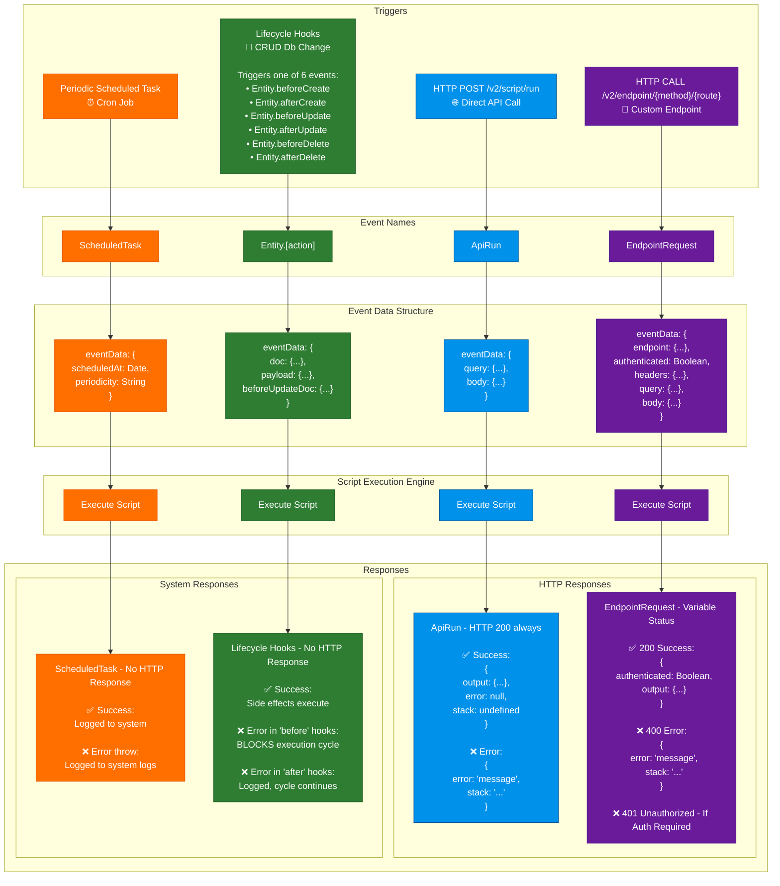

# Prolibu Script Builder Documentation

This documentation covers the event-driven architecture, script execution models, and integration patterns used in the Prolibu platform.

## 📚 Table of Contents

- [Event System Overview](#event-system-overview)
- [Event Types](#event-types)
- [Examples & Use Cases](#examples--use-cases)

## Event System Overview

The Prolibu Script Builder uses an event-driven architecture where scripts are triggered by specific events in the platform. Scripts can respond to API calls, scheduled tasks, custom endpoints, and entity lifecycle changes.

### How It Works

## Understanding the Event Flow

The diagram above shows how each event type flows through the system in 5 distinct levels:

1. **External Triggers** - The initial action that starts the event (HTTP request, cron tick, or database change)
2. **Event Names** - The system assigns a specific `eventName` identifier to categorize the event
3. **Event Data Structure** - Each event type carries different data in the `eventData` object
4. **Script Execution Engine** - Your custom script code runs with access to the eventData
5. **Responses** - The system returns different response formats depending on the event type

### Response Types

The platform uses two distinct response mechanisms:

**HTTP Responses** (Left side - Blue & Purple)
- **ApiRun**: Always returns HTTP 200 with success/error in the body
- **EndpointRequest**: Returns variable HTTP status codes (200, 400, 401) based on execution

**System Responses** (Right side - Orange & Green)
- **ScheduledTask**: No HTTP response, execution is logged to the system
- **Lifecycle Hooks**: No HTTP response, triggers side effects or blocks execution on errors

## Event Types

The platform supports 4 main event types:

| Event Type | Event Name | Trigger | Response Type | Documentation |
|------------|------------|---------|---------------|---------------|
| **ApiRun** | `'ApiRun'` | `/v2/script/run` endpoint | HTTP 200 (always) | [Details](./events/01-api-run.md) |
| **EndpointRequest** | `'EndpointRequest'` | `/v2/endpoint/{method}/{route}` | HTTP (200/400/401) | [Details](./events/03-endpoint-request.md) |
| **ScheduledTask** | `'ScheduledTask'` | Cron scheduler | System Logs | [Details](./events/02-scheduled-task.md) |
| **Lifecycle Hooks** | `'Entity.[action]'` | Entity CRUD operations | System (6 variations) | [Details](./events/04-lifecycle-hooks.md) |

## Event System Features

### 🔄 Event-Driven Architecture
- Asynchronous event processing
- Non-blocking execution model

### 🔐 Security
- API key authentication for HTTP events
- Script-level access control

### 📊 Monitoring & Logging
- Real-time log streaming via WebSockets
- Structured error handling
- Performance metrics

### 🔌 Integration Patterns
- Outbound API adapters (Salesforce, HubSpot)
- Data mapping and transformation
- Bidirectional synchronization

## Examples & Use Cases

### Real-World Implementations

The codebase includes production-ready examples:

- **[Salesforce Integration](../accounts/dev10.prolibu.com/hook-integrations/outbound-salesforce.js)** - Bidirectional sync using lifecycle hooks
- **[HubSpot Integration](../accounts/dev10.prolibu.com/hook-integrations/outbound-hubspot.js)** - CRM synchronization with OAuth2
- **[Scheduled Reports](../accounts/dev10.prolibu.com/hook-integrations/)** - Automated data processing

### Common Patterns

1. **Data Synchronization**: Sync entities between Prolibu and external systems using lifecycle hooks
2. **Scheduled Processing**: Run periodic tasks like reports, cleanups, or aggregations
3. **Custom APIs**: Expose custom business logic through dedicated endpoints
4. **Webhooks**: Receive and process external webhook events

## Getting Started

1. **Understand Event Types**: Start with the [Events Overview](./events/README.md)
2. **Choose Your Event Type**: Pick the appropriate event type for your use case
3. **Follow the Examples**: Reference the detailed documentation for each event type
4. **Test Your Script**: Use the `/v2/script/run` endpoint or watch mode for development

## Additional Resources

- **[API Adapters](../lib/vendors/)** - Vendor-specific API implementations
- **[Data Mappers](../lib/vendors/prolibu/)** - Field mapping utilities
- **[Test Examples](../accounts/dev10.prolibu.com/hook-integrations/test/)** - Integration test suites
