# Prolibu Script Builder Documentation

This documentation covers the event-driven architecture, script execution models, and integration patterns used in the Prolibu platform.

## 📚 Table of Contents

- [Event System Overview](#event-system-overview)
- [Event Types](#event-types)
- [Examples & Use Cases](#examples--use-cases)

## Event System Overview

The Prolibu Script Builder uses an event-driven architecture where scripts are triggered by specific events in the platform. Scripts can respond to API calls, scheduled tasks, custom endpoints, and entity lifecycle changes.

### How It Works

```mermaid
flowchart TB
    subgraph EventNames["Event Names"]
        API_RUN_NAME["ApiRun"]
        ENDPOINT_REQUEST_NAME["EndpointRequest"]
        SCHEDULED_TASK_NAME["ScheduledTask"]
        LIFECYCLE_HOOK_NAME["Lifecycle Hooks (6 types)"]
    end

    subgraph External["Triggers"]
        API_RUN["HTTP POST /v2/script/run<br/>🌐 Direct API Call"]
        ENDPOINT_REQUEST["HTTP CALL /v2/endpoint/{method}/{route}<br/>🔗 Custom Endpoint"]
        SCHEDULED_TASK["Periodic Scheduled Task<br/>⏰ Cron Job"]
        LIFECYCLE_HOOK["Lifecycle Hooks<br/>📝 CRUD Db Change<br/><br/>Triggers one of 6 events:<br/>• Entity.beforeCreate<br/>• Entity.afterCreate<br/>• Entity.beforeUpdate<br/>• Entity.afterUpdate<br/>• Entity.beforeDelete<br/>• Entity.afterDelete"]
    end

    subgraph EventData["Event Data Structure"]
        API_RUN_DATA["eventData: {<br/>  query: {...},<br/>  body: {...}<br/>}"]
        ENDPOINT_REQUEST_DATA["eventData: {<br/>  endpoint: {...},<br/>  authenticated: Boolean,<br/>  headers: {...},<br/>  query: {...},<br/>  body: {...}<br/>}"]
        SCHEDULED_TASK_DATA["eventData: {<br/>  scheduledAt: Date,<br/>  periodicity: String<br/>}"]
        LIFECYCLE_HOOK_DATA["eventData: {<br/>  doc: {...},<br/>  payload: {...},<br/>  beforeUpdateDoc: {...}<br/>}"]
    end

    subgraph Engine["Script Execution Engine"]
        EXECUTE_API_RUN["Execute Script"]
        EXECUTE_ENDPOINT_REQUEST["Execute Script"]
        EXECUTE_SCHEDULED_TASK["Execute Script"]
        EXECUTE_LIFECYCLE_HOOK["Execute Script"]
    end

    subgraph Responses["Responses"]
        direction LR
        subgraph HTTPResponses["HTTP Responses"]
            API_RUN_RESULT["API RUN - HTTP 200 always<br/><br/>✅ Success:<br/>{<br/>  output: {...},<br/>  error: null,<br/>  stack: undefined<br/>}<br/><br/>❌ Error:<br/>{<br/>  error: 'message',<br/>  stack: '...'<br/>}"]
            
            ENDPOINT_REQUEST_RESULT["ENDPOINT REQUEST - Variable Status<br/><br/>✅ 200 Success:<br/>{<br/>  authenticated: Boolean,<br/>  output: {...}<br/>}<br/><br/>❌ 400 Error:<br/>{<br/>  error: 'message',<br/>  stack: '...'<br/>}<br/><br/>❌ 401 Unauthorized - If Auth Required"]
        end

        subgraph SystemResponses["System Responses"]
            SCHEDULED_TASK_RESULT["SCHEDULED TASK - No HTTP Response<br/><br/>✅ Success:<br/>Logged to system<br/><br/>❌ Error throw:<br/>Logged to system logs"]
            
            LIFECYCLE_HOOK_RESULT["LIFECYCLE HOOK - No HTTP Response<br/><br/>✅ Success:<br/>Side effects execute<br/><br/>❌ Error in 'before' hooks:<br/>BLOCKS execution cycle<br/><br/>❌ Error in 'after' hooks:<br/>Logged, cycle continues"]
        end
    end

    subgraph UseCases["Use Cases"]
        API_RUN_USE["• Manual script execution<br/>• Testing & debugging<br/>• On-demand jobs"]
        ENDPOINT_REQUEST_USE["• Webhook receivers<br/>• Third-party integrations<br/>• Custom API endpoints"]
        SCHEDULED_TASK_USE["• Periodic data sync<br/>• Report generation<br/>• Automated cleanups"]
        LIFECYCLE_HOOK_USE["• No-limits parametrizations<br/>• Real-time sync to external systems<br/>• Complex data validation<br/>• Audit logging"]
    end

    API_RUN_NAME --> API_RUN
    ENDPOINT_REQUEST_NAME --> ENDPOINT_REQUEST
    SCHEDULED_TASK_NAME --> SCHEDULED_TASK
    LIFECYCLE_HOOK_NAME --> LIFECYCLE_HOOK

    API_RUN --> API_RUN_DATA
    ENDPOINT_REQUEST --> ENDPOINT_REQUEST_DATA
    SCHEDULED_TASK --> SCHEDULED_TASK_DATA
    LIFECYCLE_HOOK --> LIFECYCLE_HOOK_DATA

    API_RUN_DATA --> EXECUTE_API_RUN
    ENDPOINT_REQUEST_DATA --> EXECUTE_ENDPOINT_REQUEST
    SCHEDULED_TASK_DATA --> EXECUTE_SCHEDULED_TASK
    LIFECYCLE_HOOK_DATA --> EXECUTE_LIFECYCLE_HOOK

    EXECUTE_API_RUN --> API_RUN_RESULT
    EXECUTE_ENDPOINT_REQUEST --> ENDPOINT_REQUEST_RESULT
    EXECUTE_SCHEDULED_TASK --> SCHEDULED_TASK_RESULT
    EXECUTE_LIFECYCLE_HOOK --> LIFECYCLE_HOOK_RESULT

    API_RUN_RESULT --> API_RUN_USE
    ENDPOINT_REQUEST_RESULT --> ENDPOINT_REQUEST_USE
    SCHEDULED_TASK_RESULT --> SCHEDULED_TASK_USE
    LIFECYCLE_HOOK_RESULT --> LIFECYCLE_HOOK_USE

    style API_RUN fill:#0091EA,stroke:#01579B,color:#fff
    style ENDPOINT_REQUEST fill:#6A1B9A,stroke:#4A148C,color:#fff
    style SCHEDULED_TASK fill:#FF6F00,stroke:#E65100,color:#fff
    style LIFECYCLE_HOOK fill:#2E7D32,stroke:#1B5E20,color:#fff
    
    style API_RUN_NAME fill:#0091EA,stroke:#01579B,color:#fff
    style ENDPOINT_REQUEST_NAME fill:#6A1B9A,stroke:#4A148C,color:#fff
    style SCHEDULED_TASK_NAME fill:#FF6F00,stroke:#E65100,color:#fff
    style LIFECYCLE_HOOK_NAME fill:#2E7D32,stroke:#1B5E20,color:#fff
    
    style API_RUN_DATA fill:#0091EA,stroke:#01579B,color:#fff
    style ENDPOINT_REQUEST_DATA fill:#6A1B9A,stroke:#4A148C,color:#fff
    style SCHEDULED_TASK_DATA fill:#FF6F00,stroke:#E65100,color:#fff
    style LIFECYCLE_HOOK_DATA fill:#2E7D32,stroke:#1B5E20,color:#fff

    style EXECUTE_API_RUN fill:#0091EA,stroke:#01579B,color:#fff
    style EXECUTE_ENDPOINT_REQUEST fill:#6A1B9A,stroke:#4A148C,color:#fff
    style EXECUTE_SCHEDULED_TASK fill:#FF6F00,stroke:#E65100,color:#fff
    style EXECUTE_LIFECYCLE_HOOK fill:#2E7D32,stroke:#1B5E20,color:#fff

    style API_RUN_RESULT fill:#0091EA,stroke:#01579B,color:#fff
    style ENDPOINT_REQUEST_RESULT fill:#6A1B9A,stroke:#4A148C,color:#fff
    style SCHEDULED_TASK_RESULT fill:#FF6F00,stroke:#E65100,color:#fff
    style LIFECYCLE_HOOK_RESULT fill:#2E7D32,stroke:#1B5E20,color:#fff

    style API_RUN_USE fill:#0091EA,stroke:#01579B,color:#fff
    style ENDPOINT_REQUEST_USE fill:#6A1B9A,stroke:#4A148C,color:#fff
    style SCHEDULED_TASK_USE fill:#FF6F00,stroke:#E65100,color:#fff
    style LIFECYCLE_HOOK_USE fill:#2E7D32,stroke:#1B5E20,color:#fff
```



## Event Types

The platform supports 4 main event types:

| Event Type | Trigger | Use Case | Documentation |
|------------|---------|----------|---------------|
| **ApiRun** | `/v2/script/run` endpoint | Manual script execution via API | [Details](./events/01-api-run.md) |
| **ScheduledTask** | Cron scheduler | Periodic automated tasks | [Details](./events/02-scheduled-task.md) |
| **EndpointRequest** | Custom endpoint routes | Custom API endpoints | [Details](./events/03-endpoint-request.md) |
| **Lifecycle Hooks** | Entity CRUD operations | Real-time data synchronization | [Details](./events/04-lifecycle-hooks.md) |

## Event System Features

### 🔄 Event-Driven Architecture
- Asynchronous event processing
- Non-blocking execution model

### 🔐 Security
- API key authentication for HTTP events
- Script-level access control

### 📊 Monitoring & Logging
- Real-time log streaming via WebSockets
- Structured error handling
- Performance metrics

### 🔌 Integration Patterns

The platform supports bidirectional synchronization with external systems through two complementary patterns:

#### Outbound Integration: Prolibu → External Systems

Changes in Prolibu are automatically synced to external systems using **Lifecycle Hooks**.


**Example**: Contact created in Prolibu → afterCreate hook → Sync to Salesforce → Store Salesforce ID

#### Inbound Integration: External Systems → Prolibu

Changes in external systems are pushed to Prolibu via **Webhook Endpoints**.


**Example**: Contact updated in Salesforce → Webhook fired → Prolibu endpoint receives → Update Contact in Prolibu

**Key Features:**
- Automatic field mapping and transformation
- Conflict resolution strategies
- Retry logic on failures
- Complete bidirectional synchronization

## Integration Adapters

### Standardized API Adapter Strategy

The platform uses a **unified adapter pattern** to ensure consistent behavior across all external API integrations. All API adapters (Salesforce, HubSpot, and future integrations) follow the same interface and conventions as the core `ProlibuApi`, enabling seamless code reusability and simplified integration development.

#### Design Philosophy

The adapter strategy is built on three core principles:

1. **Interface Consistency** - All adapters expose the same methods with identical signatures
2. **Response Standardization** - All adapters return data in the same structure
3. **Error Handling Uniformity** - All adapters handle errors in the same predictable way

This means you can write integration code once and reuse it across different platforms with minimal changes.

#### Standard API Methods

Every API adapter implements these core methods with consistent behavior:

```javascript
// Core CRUD Operations - Same across all adapters
await api.create(objectName, data)           // Returns: Complete created object
await api.findOne(objectName, id, options)   // Returns: Object or null (Instead of throwing 404 error)
await api.find(objectName, options)          // Returns: { data: [], pagination: {...} }
await api.update(objectName, id, data)       // Returns: Complete updated object
await api.delete(objectName, id)             // Returns: true/false (Instead of throwing 404 error)
```

#### Behavioral Guarantees

All adapters follow these standardized behaviors:

**1. Create Operations**
- ✅ Always return the **complete created object** with all fields
- ✅ Automatically fetch full record after creation if needed
- ✅ Throw descriptive errors for validation failures

**2. Find Operations**
- ✅ Support both string queries and object-based filters
- ✅ Accept space-separated OR comma-separated field names in `select`
- ✅ Return standardized pagination structure
- ✅ Support common operators: `$exists`, `$ne`, `$gt`, `$lt`, etc.

**3. FindOne Operations**
- ✅ Return `null` for 404 (not found) instead of throwing
- ✅ Only throw for real errors (permissions, network, etc.)
- ✅ Consistent behavior across all adapters

**4. Update Operations**
- ✅ Always return the **complete updated object** with all fields
- ✅ Only require changed fields in the data parameter
- ✅ Automatically fetch full record after update

**5. Delete Operations**
- ✅ Return `boolean`: `true` if deleted, `false` if not found (404)
- ✅ Never throw on 404, only for permissions/network errors
- ✅ Consistent error handling across all adapters

**6. Error Handling**
- ✅ All errors are thrown as standardized objects.

#### Available Adapters
- **SalesforceApi** - Full-featured Salesforce REST API adapter
- **HubSpotApi** - Comprehensive HubSpot CRM API adapter