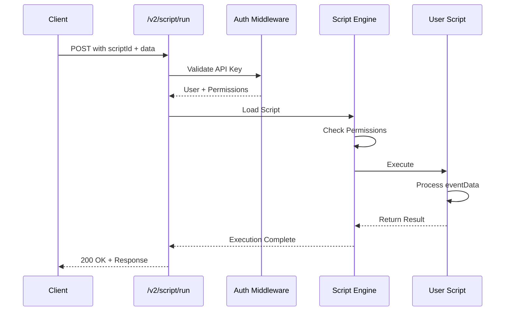

# ApiRun Events

**Event Type:** `ApiRun`  
**Trigger:** HTTP POST request to `/v2/script/run`  
**Authentication:** Required (API Key)  
**Use Case:** Manual script execution, ad-hoc operations, testing

## Overview

ApiRun events allow you to execute scripts on-demand via HTTP API. This is the most flexible event type, perfect for:

- Manual operations and administrative tasks
- Integration with external systems
- Testing and development
- One-off data processing tasks

## How It Works



## Trigger Method

### HTTP Endpoint

```
POST /v2/script/run
```

### Authentication

Include API key in one of these ways:

**Option 1: Header**
```http
Authorization: Bearer YOUR_API_KEY
```

**Option 2: Query Parameter**
```
POST /v2/script/run?apiKey=YOUR_API_KEY
```

### Request Format

#### Required Parameters

```javascript
{
  scriptId: String,  // ID of the script to execute
}
```

#### Optional Parameters

```javascript
{
  query: Object,     // Query parameters to pass to the script
  body: Object,      // Request body to pass to the script
}
```

### Complete Request Example

```bash
curl -X POST https://api.prolibu.com/v2/script/run \
  -H "Authorization: Bearer YOUR_API_KEY" \
  -H "Content-Type: application/json" \
  -d '{
    "scriptId": "507f1f77bcf86cd799439011",
    "query": {
      "filter": "active",
      "limit": 100
    },
    "body": {
      "action": "process",
      "data": {
        "customField": "value"
      }
    }
  }'
```

## Event Data Structure

When your script executes, it receives the following `eventData` object:

```javascript
{
  // Base fields
  apiKey: String,           // The API key used
  requestUser: Object,      // Full user object
  eventName: "ApiRun",
  scriptId: String,
  
  // ApiRun-specific fields
  eventData: {
    query: Object,          // URL query parameters
    body: Object,           // Request body
  }
}
```

### Example Event Data

```javascript
{
  apiKey: "ak_1234567890abcdef",
  requestUser: {
    _id: "507f1f77bcf86cd799439011",
    email: "user@example.com",
    name: "John Doe",
    role: "admin"
  },
  eventName: "ApiRun",
  scriptId: "507f191e810c19729de860ea",
  eventData: {
    query: {
      filter: "active",
      limit: 100
    },
    body: {
      action: "process",
      data: {
        customField: "value"
      }
    }
  }
}
```

## Script Implementation

### Basic Structure

```javascript
module.exports = async ({ API, eventData, requestUser }) => {
  // Extract data from the event
  const { query, body } = eventData;
  
  // Your script logic here
  const result = await processData(query, body);
  
  // Return response
  return {
    success: true,
    data: result
  };
};
```

### Accessing Request Data

```javascript
module.exports = async ({ API, eventData, requestUser }) => {
  // Query parameters
  const filter = eventData.query?.filter || 'all';
  const limit = parseInt(eventData.query?.limit) || 10;
  
  // Body data
  const action = eventData.body?.action;
  const customData = eventData.body?.data;
  
  // User information
  const userId = requestUser._id;
  const userEmail = requestUser.email;
  
  // Process...
  return { filter, limit, action, customData };
};
```

### Example: Data Processing Script

```javascript
module.exports = async ({ API, eventData, requestUser, logger }) => {
  const { query, body } = eventData;
  
  try {
    logger.info('Starting data processing', { query, body });
    
    // Fetch records from Prolibu
    const records = await API.prolibu.find('Contact', {
      filter: {
        status: query.filter || 'active',
      },
      select: 'name email mobile',
      limit: parseInt(query.limit) || 100,
    });
    
    logger.info(`Found ${records.length} records`);
    
    // Process each record
    const results = await Promise.all(
      records.map(async (record) => {
        const processed = await processRecord(record, body.data);
        return processed;
      })
    );
    
    return {
      success: true,
      processed: results.length,
      data: results,
    };
    
  } catch (error) {
    logger.error('Processing failed', error);
    
    return {
      success: false,
      error: error.message,
    };
  }
};

async function processRecord(record, customData) {
  // Your processing logic
  return {
    id: record._id,
    name: record.name,
    processed: true,
    ...customData,
  };
}
```

### Example: External API Integration

```javascript
module.exports = async ({ API, eventData, requestUser, logger }) => {
  const { accountId, syncType } = eventData.body;
  
  try {
    // Fetch data from Prolibu
    const contact = await API.prolibu.findOne('Contact', accountId);
    
    if (!contact) {
      return {
        success: false,
        error: 'Contact not found',
      };
    }
    
    // Sync to Salesforce
    const sfResult = await API.salesforce.upsert('Contact', {
      Email: contact.email,
    }, {
      FirstName: contact.name?.split(' ')[0],
      LastName: contact.name?.split(' ').slice(1).join(' '),
      MobilePhone: contact.mobile,
    });
    
    logger.info('Synced to Salesforce', { contactId: accountId, sfId: sfResult.id });
    
    return {
      success: true,
      prolibuId: contact._id,
      salesforceId: sfResult.id,
      syncType,
    };
    
  } catch (error) {
    logger.error('Sync failed', error);
    throw error;
  }
};
```

## Response Format

### Success Response

```javascript
{
  success: true,
  data: {
    // Your custom response data
  },
  executionTime: 1234, // milliseconds
  scriptId: "507f191e810c19729de860ea"
}
```

### Error Response

```javascript
{
  success: false,
  error: {
    message: "Error description",
    code: "ERROR_CODE",
    statusCode: 500,
    details: {
      // Additional error context
    }
  },
  executionTime: 567,
  scriptId: "507f191e810c19729de860ea"
}
```

## Use Cases

### 1. Manual Data Synchronization

Trigger a sync between Prolibu and external systems on-demand:

```bash
curl -X POST https://api.prolibu.com/v2/script/run \
  -H "Authorization: Bearer YOUR_API_KEY" \
  -H "Content-Type: application/json" \
  -d '{
    "scriptId": "sync-contacts-script",
    "body": {
      "syncDirection": "prolibu-to-salesforce",
      "includeDeleted": false
    }
  }'
```

### 2. Administrative Operations

Execute admin tasks like data cleanup or migrations:

```bash
curl -X POST https://api.prolibu.com/v2/script/run \
  -H "Authorization: Bearer YOUR_API_KEY" \
  -H "Content-Type: application/json" \
  -d '{
    "scriptId": "cleanup-duplicates",
    "query": {
      "dryRun": "true"
    }
  }'
```

### 3. Testing & Development

Test your scripts during development:

```bash
curl -X POST https://api.prolibu.com/v2/script/run \
  -H "Authorization: Bearer YOUR_API_KEY" \
  -H "Content-Type: application/json" \
  -d '{
    "scriptId": "test-script",
    "body": {
      "testData": "sample"
    }
  }'
```

### 4. Integration with External Systems

Allow external systems to trigger Prolibu operations:

```javascript
// External system code
const axios = require('axios');

async function triggerProlibuScript(data) {
  const response = await axios.post('https://api.prolibu.com/v2/script/run', {
    scriptId: 'process-webhook',
    body: {
      source: 'external-system',
      data: data,
    }
  }, {
    headers: {
      'Authorization': `Bearer ${PROLIBU_API_KEY}`,
    }
  });
  
  return response.data;
}
```

## Best Practices

### ✅ DO

- **Validate Input**: Always validate `query` and `body` parameters
- **Use Authentication**: Never skip API key validation
- **Return Structured Data**: Use consistent response format
- **Log Important Events**: Use `logger.info()` and `logger.error()`
- **Handle Errors Gracefully**: Catch and return meaningful error messages
- **Set Timeouts**: For long-running operations, implement timeouts
- **Document Parameters**: Document expected query/body structure

### ❌ DON'T

- **Expose Secrets**: Never log or return API keys or sensitive data
- **Skip Validation**: Don't trust input without validation
- **Block Indefinitely**: Avoid operations that might hang
- **Return Large Payloads**: Paginate large datasets
- **Ignore Errors**: Always handle and log errors properly

## Error Handling

### Common Errors

#### 401 Unauthorized
```javascript
// Missing or invalid API key
{
  success: false,
  error: {
    message: "Invalid or missing API key",
    code: "UNAUTHORIZED",
    statusCode: 401
  }
}
```

#### 403 Forbidden
```javascript
// User doesn't have permission to execute script
{
  success: false,
  error: {
    message: "Insufficient permissions",
    code: "FORBIDDEN",
    statusCode: 403
  }
}
```

#### 404 Not Found
```javascript
// Script doesn't exist
{
  success: false,
  error: {
    message: "Script not found",
    code: "NOT_FOUND",
    statusCode: 404
  }
}
```

#### 500 Internal Error
```javascript
// Script execution error
{
  success: false,
  error: {
    message: "Script execution failed: Cannot read property 'name' of undefined",
    code: "INTERNAL_ERROR",
    statusCode: 500,
    details: {
      stack: "..." // Only in development
    }
  }
}
```

### Implementing Error Handling

```javascript
module.exports = async ({ API, eventData, requestUser, logger }) => {
  try {
    // Validate required parameters
    if (!eventData.body?.accountId) {
      return {
        success: false,
        error: {
          message: 'accountId is required',
          code: 'VALIDATION_ERROR',
        }
      };
    }
    
    // Your logic here
    const result = await processAccount(eventData.body.accountId);
    
    return {
      success: true,
      data: result,
    };
    
  } catch (error) {
    logger.error('Script execution failed', error);
    
    // Return structured error
    return {
      success: false,
      error: {
        message: error.message,
        code: error.code || 'INTERNAL_ERROR',
        details: process.env.NODE_ENV === 'development' ? error.stack : undefined,
      }
    };
  }
};
```

## Testing

### Using cURL

```bash
# Test script execution
curl -X POST https://api.prolibu.com/v2/script/run \
  -H "Authorization: Bearer YOUR_API_KEY" \
  -H "Content-Type: application/json" \
  -d '{
    "scriptId": "your-script-id",
    "query": { "test": true },
    "body": { "data": "sample" }
  }' | jq
```

### Using Postman

1. Create new POST request to `/v2/script/run`
2. Add `Authorization: Bearer YOUR_API_KEY` header
3. Add JSON body with `scriptId`, `query`, and `body`
4. Send request and inspect response

### Using Node.js

```javascript
const axios = require('axios');

async function runScript() {
  try {
    const response = await axios.post('https://api.prolibu.com/v2/script/run', {
      scriptId: 'your-script-id',
      query: { filter: 'active' },
      body: { action: 'test' }
    }, {
      headers: {
        'Authorization': 'Bearer YOUR_API_KEY',
        'Content-Type': 'application/json'
      }
    });
    
    console.log('Result:', response.data);
  } catch (error) {
    console.error('Error:', error.response?.data || error.message);
  }
}

runScript();
```

## Security Considerations

### API Key Security

- **Store Securely**: Never commit API keys to version control
- **Rotate Regularly**: Change API keys periodically
- **Limit Scope**: Use API keys with minimal required permissions
- **Monitor Usage**: Track API key usage for suspicious activity

### Input Validation

```javascript
module.exports = async ({ API, eventData, requestUser, logger }) => {
  // Validate types
  if (typeof eventData.query?.limit !== 'undefined' && 
      isNaN(parseInt(eventData.query.limit))) {
    return {
      success: false,
      error: { message: 'limit must be a number' }
    };
  }
  
  // Sanitize strings
  const safeName = eventData.body?.name?.trim().substring(0, 100);
  
  // Validate arrays
  if (Array.isArray(eventData.body?.ids) && 
      eventData.body.ids.length > 1000) {
    return {
      success: false,
      error: { message: 'Too many IDs (max 1000)' }
    };
  }
  
  // Continue processing...
};
```

### Rate Limiting

Implement rate limiting in your scripts:

```javascript
const rateLimit = new Map();

module.exports = async ({ API, eventData, requestUser, logger }) => {
  const userId = requestUser._id;
  const now = Date.now();
  const limit = 10; // requests per minute
  const window = 60000; // 1 minute
  
  // Check rate limit
  const userRequests = rateLimit.get(userId) || [];
  const recentRequests = userRequests.filter(time => now - time < window);
  
  if (recentRequests.length >= limit) {
    return {
      success: false,
      error: {
        message: 'Rate limit exceeded',
        code: 'RATE_LIMIT_EXCEEDED',
        statusCode: 429,
      }
    };
  }
  
  // Update rate limit
  rateLimit.set(userId, [...recentRequests, now]);
  
  // Process request...
};
```

## Related Documentation

- **[Event System Overview](./README.md)** - Understanding the event system
- **[ScheduledTask Events](./02-scheduled-task.md)** - Automated periodic execution
- **[EndpointRequest Events](./03-endpoint-request.md)** - Custom API endpoints

---

**Back to:** [Events Overview](./README.md) | [Main Documentation](../README.md)
