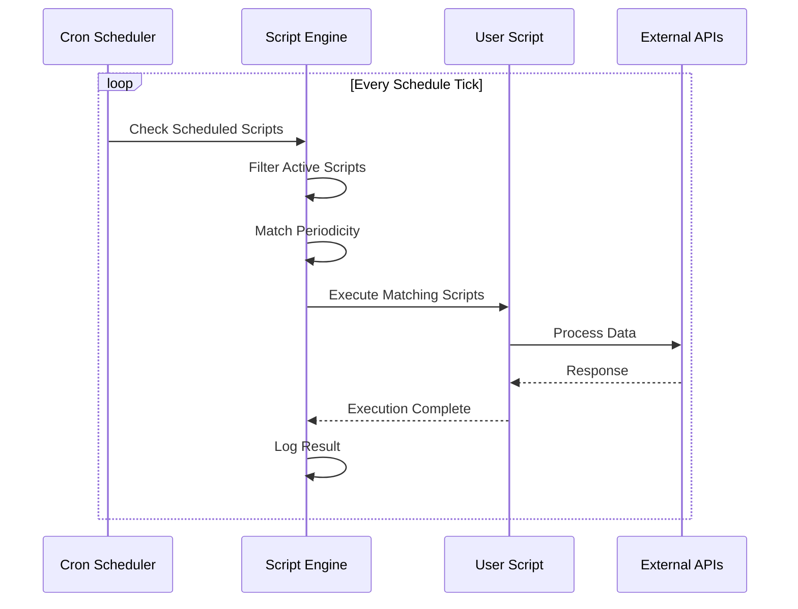

# ScheduledTask Events

**Event Type:** `ScheduledTask`  
**Trigger:** Cron scheduler based on periodicity configuration  
**Authentication:** System (No API key required)  
**Use Case:** Automated periodic tasks, batch processing, scheduled reports

## Overview

ScheduledTask events allow you to run scripts automatically on a recurring schedule. Perfect for:

- Nightly data synchronizations
- Scheduled reports and exports
- Periodic cleanup tasks
- Automated backups
- Batch processing operations
- Health checks and monitoring

## How It Works



## Configuration

### Script Configuration

Scheduled tasks are configured in the script's metadata:

```javascript
{
  scriptId: "507f191e810c19729de860ea",
  name: "Daily Sync Task",
  eventName: "ScheduledTask",
  active: true,
  periodicity: "0 2 * * *",  // Cron expression
  config: {
    // Additional configuration
    timezone: "America/New_York",
    retryOnFailure: true,
    maxRetries: 3
  }
}
```

### Periodicity (Cron Syntax)

Use standard cron expressions to define the schedule:

```
 ┌────────────── minute (0 - 59)
 │ ┌──────────── hour (0 - 23)
 │ │ ┌────────── day of month (1 - 31)
 │ │ │ ┌──────── month (1 - 12)
 │ │ │ │ ┌────── day of week (0 - 7) (Sunday = 0 or 7)
 │ │ │ │ │
 * * * * *
```

### Common Schedules

| Schedule | Cron Expression | Description |
|----------|----------------|-------------|
| Every minute | `* * * * *` | Every minute |
| Every hour | `0 * * * *` | At minute 0 of every hour |
| Daily at 2 AM | `0 2 * * *` | At 02:00 every day |
| Daily at noon | `0 12 * * *` | At 12:00 every day |
| Every Monday at 9 AM | `0 9 * * 1` | At 09:00 on Monday |
| First day of month | `0 0 1 * *` | At 00:00 on day 1 |
| Every 15 minutes | `*/15 * * * *` | Every 15 minutes |
| Every 6 hours | `0 */6 * * *` | Every 6 hours |
| Weekdays at 6 PM | `0 18 * * 1-5` | At 18:00 Monday through Friday |
| Every Sunday at 3 AM | `0 3 * * 0` | At 03:00 on Sunday |

### Examples

```javascript
// Every day at 2 AM
periodicity: "0 2 * * *"

// Every hour
periodicity: "0 * * * *"

// Every 30 minutes
periodicity: "*/30 * * * *"

// Monday to Friday at 9 AM
periodicity: "0 9 * * 1-5"

// First day of every month at midnight
periodicity: "0 0 1 * *"
```

## Event Data Structure

When your scheduled script executes, it receives:

```javascript
{
  // Base fields
  apiKey: null,                 // No API key (system trigger)
  requestUser: null,            // No user context
  eventName: "ScheduledTask",
  scriptId: String,
  
  // ScheduledTask-specific fields
  eventData: {
    scheduledAt: Date,          // When this execution was scheduled
    periodicity: String,        // Cron expression
    executionCount: Number,     // Number of times this script has run
    lastExecution: Date,        // Last successful execution time
  }
}
```

### Example Event Data

```javascript
{
  apiKey: null,
  requestUser: null,
  eventName: "ScheduledTask",
  scriptId: "507f191e810c19729de860ea",
  eventData: {
    scheduledAt: "2025-10-16T02:00:00.000Z",
    periodicity: "0 2 * * *",
    executionCount: 145,
    lastExecution: "2025-10-15T02:00:00.000Z"
  }
}
```

## Script Implementation

### Basic Structure

```javascript
module.exports = async ({ API, eventData, logger }) => {
  logger.info('Scheduled task started', {
    scheduledAt: eventData.scheduledAt,
    periodicity: eventData.periodicity
  });
  
  try {
    // Your scheduled logic here
    await performScheduledTask();
    
    logger.info('Scheduled task completed successfully');
    
    return {
      success: true,
      message: 'Task completed'
    };
    
  } catch (error) {
    logger.error('Scheduled task failed', error);
    throw error; // Will trigger retry if configured
  }
};

async function performScheduledTask() {
  // Implementation...
}
```

### Example: Daily Data Sync

```javascript
module.exports = async ({ API, eventData, logger }) => {
  const startTime = Date.now();
  
  logger.info('Starting daily sync', {
    scheduledAt: eventData.scheduledAt,
    lastExecution: eventData.lastExecution
  });
  
  try {
    // 1. Fetch all active contacts from Prolibu
    const contacts = await API.prolibu.find('Contact', {
      filter: {
        status: 'active',
        updatedAt: { $gte: eventData.lastExecution } // Only sync changed records
      },
      select: 'name email mobile company updatedAt',
      limit: 1000
    });
    
    logger.info(`Found ${contacts.length} contacts to sync`);
    
    // 2. Sync to Salesforce
    const results = await Promise.allSettled(
      contacts.map(contact => syncContactToSalesforce(contact, API, logger))
    );
    
    // 3. Analyze results
    const successful = results.filter(r => r.status === 'fulfilled').length;
    const failed = results.filter(r => r.status === 'rejected').length;
    
    const duration = Date.now() - startTime;
    
    logger.info('Daily sync completed', {
      total: contacts.length,
      successful,
      failed,
      duration: `${duration}ms`
    });
    
    return {
      success: true,
      stats: {
        total: contacts.length,
        successful,
        failed,
        duration
      }
    };
    
  } catch (error) {
    logger.error('Daily sync failed', error);
    throw error;
  }
};

async function syncContactToSalesforce(contact, API, logger) {
  try {
    const sfContact = await API.salesforce.upsert('Contact', {
      Email: contact.email
    }, {
      FirstName: contact.name?.split(' ')[0],
      LastName: contact.name?.split(' ').slice(1).join(' ') || 'Unknown',
      MobilePhone: contact.mobile,
      Company: contact.company
    });
    
    logger.debug('Contact synced', {
      prolibuId: contact._id,
      salesforceId: sfContact.id
    });
    
    return sfContact;
    
  } catch (error) {
    logger.error('Failed to sync contact', {
      contactId: contact._id,
      error: error.message
    });
    throw error;
  }
}
```

### Example: Weekly Report Generation

```javascript
module.exports = async ({ API, eventData, logger }) => {
  logger.info('Generating weekly report');
  
  try {
    // Calculate date range (last 7 days)
    const endDate = new Date();
    const startDate = new Date();
    startDate.setDate(startDate.getDate() - 7);
    
    // 1. Fetch data from Prolibu
    const contacts = await API.prolibu.find('Contact', {
      filter: {
        createdAt: {
          $gte: startDate,
          $lte: endDate
        }
      },
      select: 'name email createdAt status'
    });
    
    // 2. Generate statistics
    const stats = {
      totalContacts: contacts.length,
      byStatus: {},
      dailyBreakdown: {}
    };
    
    contacts.forEach(contact => {
      // Count by status
      stats.byStatus[contact.status] = (stats.byStatus[contact.status] || 0) + 1;
      
      // Count by day
      const day = contact.createdAt.toISOString().split('T')[0];
      stats.dailyBreakdown[day] = (stats.dailyBreakdown[day] || 0) + 1;
    });
    
    // 3. Format report
    const report = {
      title: 'Weekly Contact Report',
      period: {
        start: startDate.toISOString(),
        end: endDate.toISOString()
      },
      statistics: stats,
      generatedAt: new Date().toISOString()
    };
    
    logger.info('Weekly report generated', report);
    
    // 4. Store report (optional)
    await API.prolibu.create('Report', {
      type: 'weekly-contacts',
      data: report,
      generatedAt: new Date()
    });
    
    // 5. Send email notification (optional)
    // await sendReportEmail(report);
    
    return {
      success: true,
      report
    };
    
  } catch (error) {
    logger.error('Report generation failed', error);
    throw error;
  }
};
```

### Example: Cleanup Task

```javascript
module.exports = async ({ API, eventData, logger }) => {
  logger.info('Starting cleanup task');
  
  try {
    const thirtyDaysAgo = new Date();
    thirtyDaysAgo.setDate(thirtyDaysAgo.getDate() - 30);
    
    // 1. Find old records to archive
    const oldRecords = await API.prolibu.find('TempData', {
      filter: {
        createdAt: { $lt: thirtyDaysAgo },
        archived: false
      },
      select: '_id createdAt',
      limit: 500 // Process in batches
    });
    
    logger.info(`Found ${oldRecords.length} records to archive`);
    
    // 2. Archive records
    let archived = 0;
    for (const record of oldRecords) {
      try {
        await API.prolibu.update('TempData', record._id, {
          archived: true,
          archivedAt: new Date()
        });
        archived++;
      } catch (error) {
        logger.error('Failed to archive record', {
          recordId: record._id,
          error: error.message
        });
      }
    }
    
    // 3. Delete very old archived records (> 90 days)
    const ninetyDaysAgo = new Date();
    ninetyDaysAgo.setDate(ninetyDaysAgo.getDate() - 90);
    
    const veryOldRecords = await API.prolibu.find('TempData', {
      filter: {
        archived: true,
        archivedAt: { $lt: ninetyDaysAgo }
      },
      select: '_id',
      limit: 100
    });
    
    logger.info(`Found ${veryOldRecords.length} records to delete`);
    
    let deleted = 0;
    for (const record of veryOldRecords) {
      const success = await API.prolibu.delete('TempData', record._id);
      if (success) deleted++;
    }
    
    logger.info('Cleanup completed', { archived, deleted });
    
    return {
      success: true,
      stats: {
        archived,
        deleted,
        remaining: oldRecords.length - archived
      }
    };
    
  } catch (error) {
    logger.error('Cleanup task failed', error);
    throw error;
  }
};
```

## Use Cases

### 1. Nightly Synchronization

Sync all data changes from the previous day:

```javascript
// Cron: 0 2 * * * (Daily at 2 AM)
periodicity: "0 2 * * *"

// Script syncs all records modified in last 24 hours
filter: {
  updatedAt: { $gte: new Date(Date.now() - 24 * 60 * 60 * 1000) }
}
```

### 2. Weekly Reports

Generate and distribute reports every Monday:

```javascript
// Cron: 0 9 * * 1 (Monday at 9 AM)
periodicity: "0 9 * * 1"

// Script generates report for previous week
```

### 3. Hourly Health Checks

Monitor system health every hour:

```javascript
// Cron: 0 * * * * (Every hour)
periodicity: "0 * * * *"

// Script checks API availability, database connections, etc.
```

### 4. Monthly Aggregations

Calculate monthly statistics:

```javascript
// Cron: 0 0 1 * * (First day of month at midnight)
periodicity: "0 0 1 * *"

// Script aggregates previous month's data
```

### 5. Continuous Batch Processing

Process queued items every 5 minutes:

```javascript
// Cron: */5 * * * * (Every 5 minutes)
periodicity: "*/5 * * * *"

// Script processes pending queue items
```

## Best Practices

### ✅ DO

- **Use Appropriate Schedules**: Don't run too frequently if not needed
- **Implement Batch Processing**: Process records in chunks for large datasets
- **Log Progress**: Log start, progress, and completion
- **Handle Failures Gracefully**: Implement retry logic and error recovery
- **Monitor Execution Time**: Track how long tasks take
- **Use Idempotency**: Ensure scripts can be safely re-run
- **Set Realistic Timeouts**: Consider script execution limits
- **Archive Old Data**: Clean up after processing when appropriate

### ❌ DON'T

- **Schedule Too Frequently**: Avoid unnecessary load (use appropriate intervals)
- **Process Everything at Once**: Break large operations into batches
- **Ignore Errors**: Always log and handle failures
- **Run Long Operations**: Keep execution time reasonable
- **Skip Validation**: Validate data even in scheduled tasks
- **Forget Timezones**: Be explicit about timezone requirements
- **Overlook Monitoring**: Track execution success/failure rates

## Error Handling & Retry Logic

### Automatic Retry

If configured, failed tasks can automatically retry:

```javascript
config: {
  retryOnFailure: true,
  maxRetries: 3,
  retryDelay: 60000 // 1 minute between retries
}
```

### Implementing Retry Logic

```javascript
module.exports = async ({ API, eventData, logger }) => {
  const maxAttempts = 3;
  let attempt = 0;
  let lastError;
  
  while (attempt < maxAttempts) {
    attempt++;
    
    try {
      logger.info(`Attempt ${attempt} of ${maxAttempts}`);
      
      // Your task logic
      const result = await performTask();
      
      logger.info('Task completed successfully', { attempt });
      return { success: true, result, attempts: attempt };
      
    } catch (error) {
      lastError = error;
      logger.error(`Attempt ${attempt} failed`, error);
      
      if (attempt < maxAttempts) {
        const delay = Math.pow(2, attempt) * 1000; // Exponential backoff
        logger.info(`Retrying in ${delay}ms...`);
        await new Promise(resolve => setTimeout(resolve, delay));
      }
    }
  }
  
  // All attempts failed
  logger.error('All retry attempts failed', lastError);
  throw lastError;
};
```

### Partial Failure Handling

```javascript
module.exports = async ({ API, eventData, logger }) => {
  const records = await fetchRecordsToProcess();
  
  const results = {
    total: records.length,
    successful: [],
    failed: []
  };
  
  for (const record of records) {
    try {
      const result = await processRecord(record);
      results.successful.push({ id: record._id, result });
    } catch (error) {
      results.failed.push({
        id: record._id,
        error: error.message
      });
      logger.error('Record processing failed', {
        recordId: record._id,
        error: error.message
      });
    }
  }
  
  logger.info('Batch processing completed', {
    total: results.total,
    successful: results.successful.length,
    failed: results.failed.length
  });
  
  // Return results even if some failed
  return {
    success: results.failed.length === 0,
    partial: results.failed.length > 0 && results.successful.length > 0,
    results
  };
};
```

## Monitoring & Logging

### Structured Logging

```javascript
module.exports = async ({ API, eventData, logger }) => {
  const taskId = `task-${Date.now()}`;
  
  logger.info('Task started', {
    taskId,
    scheduledAt: eventData.scheduledAt,
    periodicity: eventData.periodicity
  });
  
  const startTime = Date.now();
  
  try {
    // Task logic...
    const result = await performTask();
    
    const duration = Date.now() - startTime;
    
    logger.info('Task completed', {
      taskId,
      duration,
      recordsProcessed: result.count
    });
    
    return { success: true, taskId, duration, result };
    
  } catch (error) {
    const duration = Date.now() - startTime;
    
    logger.error('Task failed', {
      taskId,
      duration,
      error: error.message,
      stack: error.stack
    });
    
    throw error;
  }
};
```

### Progress Tracking

```javascript
module.exports = async ({ API, eventData, logger }) => {
  const records = await fetchRecordsToProcess();
  const total = records.length;
  let processed = 0;
  
  logger.info(`Starting batch processing of ${total} records`);
  
  for (let i = 0; i < records.length; i++) {
    await processRecord(records[i]);
    processed++;
    
    // Log progress every 10%
    if (processed % Math.ceil(total / 10) === 0) {
      const percent = Math.round((processed / total) * 100);
      logger.info(`Progress: ${percent}% (${processed}/${total})`);
    }
  }
  
  logger.info('Batch processing completed', {
    total,
    processed
  });
  
  return { success: true, processed };
};
```

## Performance Optimization

### Batch Processing

```javascript
module.exports = async ({ API, eventData, logger }) => {
  const BATCH_SIZE = 100;
  let offset = 0;
  let total = 0;
  
  while (true) {
    // Fetch batch
    const batch = await API.prolibu.find('Contact', {
      filter: { status: 'pending' },
      limit: BATCH_SIZE,
      skip: offset
    });
    
    if (batch.length === 0) break;
    
    // Process batch
    await Promise.all(batch.map(record => processRecord(record)));
    
    total += batch.length;
    offset += BATCH_SIZE;
    
    logger.info(`Processed batch: ${total} total records`);
    
    // Optional: Add small delay between batches
    await new Promise(resolve => setTimeout(resolve, 100));
  }
  
  logger.info(`Completed: ${total} records processed`);
  return { success: true, total };
};
```

### Parallel Processing

```javascript
module.exports = async ({ API, eventData, logger }) => {
  const records = await fetchRecordsToProcess();
  const CONCURRENCY = 10; // Process 10 at a time
  
  const results = [];
  
  for (let i = 0; i < records.length; i += CONCURRENCY) {
    const batch = records.slice(i, i + CONCURRENCY);
    
    const batchResults = await Promise.allSettled(
      batch.map(record => processRecord(record))
    );
    
    results.push(...batchResults);
    
    logger.info(`Processed ${Math.min(i + CONCURRENCY, records.length)} of ${records.length}`);
  }
  
  const successful = results.filter(r => r.status === 'fulfilled').length;
  const failed = results.filter(r => r.status === 'rejected').length;
  
  return {
    success: true,
    total: records.length,
    successful,
    failed
  };
};
```

## Testing

### Manual Testing

You can trigger a scheduled task manually via API for testing:

```bash
curl -X POST https://api.prolibu.com/v2/script/run \
  -H "Authorization: Bearer YOUR_API_KEY" \
  -H "Content-Type: application/json" \
  -d '{
    "scriptId": "your-scheduled-script-id",
    "body": {
      "testMode": true
    }
  }'
```

### Test Mode Implementation

```javascript
module.exports = async ({ API, eventData, logger }) => {
  const isTestMode = eventData.body?.testMode === true;
  
  if (isTestMode) {
    logger.info('Running in TEST MODE');
  }
  
  // Use smaller batch size in test mode
  const limit = isTestMode ? 10 : 1000;
  
  const records = await API.prolibu.find('Contact', {
    filter: { status: 'active' },
    limit
  });
  
  logger.info(`Processing ${records.length} records`);
  
  // Process...
  
  return {
    success: true,
    testMode: isTestMode,
    processed: records.length
  };
};
```

## Related Documentation

- **[Event System Overview](./README.md)** - Understanding the event system
- **[ApiRun Events](./01-api-run.md)** - Manual script execution
- **[Lifecycle Hook Events](./04-lifecycle-hooks.md)** - Real-time entity synchronization

---

**Back to:** [Events Overview](./README.md) | [Main Documentation](../README.md)
