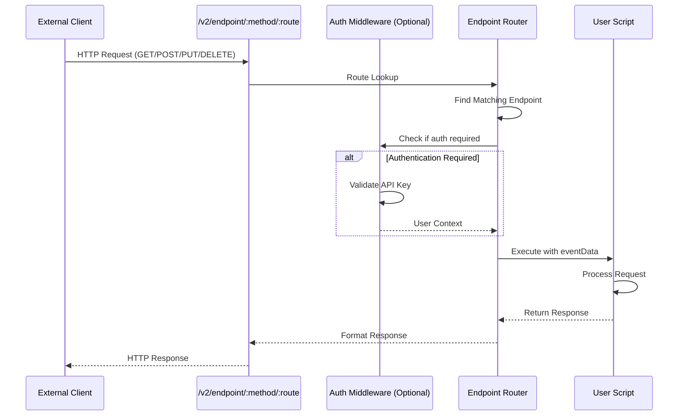

# EndpointRequest Events

**Event Type:** `EndpointRequest`  
**Trigger:** HTTP request to custom endpoint route  
**Authentication:** Optional (API Key)  
**Use Case:** Custom API endpoints, webhooks, external integrations

## Overview

EndpointRequest events allow you to create custom HTTP endpoints that execute your scripts. Perfect for:

- Receiving webhooks from external systems
- Creating custom REST APIs
- Building integration endpoints
- Exposing business logic as API services
- Handling third-party callbacks

## How It Works



## Endpoint Configuration

### Creating an Endpoint

Endpoints are configured in your account settings or via the API:

```javascript
{
  _id: "507f191e810c19729de860ea",
  endpointCode: "webhook-receiver",
  endpointName: "Salesforce Webhook",
  routeName: "salesforce/webhook",
  url: "/v2/endpoint/post/salesforce/webhook",
  method: "POST",                    // GET, POST, PUT, DELETE
  scriptId: "507f1f77bcf86cd799439011",
  authenticated: false,              // Require API key?
  active: true
}
```

### Endpoint URL Structure

```
/v2/endpoint/:method/:route
```

- **method**: HTTP method (get, post, put, delete)
- **route**: Your custom route path

### Examples

```
POST   /v2/endpoint/post/salesforce/webhook
GET    /v2/endpoint/get/reports/summary
PUT    /v2/endpoint/put/contacts/sync
DELETE /v2/endpoint/delete/cache/clear
```

## Trigger Method

### Making Requests

#### POST Request

```bash
curl -X POST https://api.prolibu.com/v2/endpoint/post/salesforce/webhook \
  -H "Content-Type: application/json" \
  -d '{
    "event": "contact.created",
    "data": {
      "contactId": "003xx000004TmiOAAS",
      "email": "john@example.com"
    }
  }'
```

#### GET Request

```bash
curl -X GET "https://api.prolibu.com/v2/endpoint/get/reports/summary?period=week&format=json"
```

#### With Authentication

```bash
curl -X POST https://api.prolibu.com/v2/endpoint/post/secure/action \
  -H "Authorization: Bearer YOUR_API_KEY" \
  -H "Content-Type: application/json" \
  -d '{"action": "process"}'
```

## Event Data Structure

When your endpoint is called, the script receives:

```javascript
{
  // Base fields
  apiKey: String,              // API key if authenticated, null otherwise
  requestUser: Object,         // User object if authenticated, null otherwise
  eventName: "EndpointRequest",
  scriptId: String,
  
  // EndpointRequest-specific fields
  eventData: {
    endpoint: {
      _id: String,
      endpointCode: String,
      endpointName: String,
      routeName: String,
      url: String,
      method: String,          // GET, POST, PUT, DELETE
    },
    authenticated: Boolean,    // Whether request was authenticated
    headers: Object,           // Request headers
    query: Object,             // URL query parameters
    body: Object,              // Request body (POST/PUT)
    params: Object,            // URL path parameters
    ip: String,                // Client IP address
  }
}
```

### Example Event Data

```javascript
{
  apiKey: null,
  requestUser: null,
  eventName: "EndpointRequest",
  scriptId: "507f191e810c19729de860ea",
  eventData: {
    endpoint: {
      _id: "507f191e810c19729de860ea",
      endpointCode: "salesforce-webhook",
      endpointName: "Salesforce Webhook",
      routeName: "salesforce/webhook",
      url: "/v2/endpoint/post/salesforce/webhook",
      method: "POST"
    },
    authenticated: false,
    headers: {
      "content-type": "application/json",
      "user-agent": "Salesforce/1.0",
      "x-salesforce-signature": "abc123..."
    },
    query: {},
    body: {
      event: "contact.created",
      data: {
        contactId: "003xx000004TmiOAAS",
        email: "john@example.com",
        firstName: "John",
        lastName: "Doe"
      }
    },
    params: {},
    ip: "192.168.1.100"
  }
}
```

## Script Implementation

### Basic Structure

```javascript
module.exports = async ({ API, eventData, requestUser, logger }) => {
  const { endpoint, headers, query, body, authenticated } = eventData;
  
  logger.info('Endpoint called', {
    endpoint: endpoint.routeName,
    method: endpoint.method,
    authenticated
  });
  
  try {
    // Your endpoint logic here
    const result = await handleRequest(body, query);
    
    // Return HTTP response
    return {
      statusCode: 200,
      body: {
        success: true,
        data: result
      }
    };
    
  } catch (error) {
    logger.error('Endpoint error', error);
    
    return {
      statusCode: 500,
      body: {
        success: false,
        error: error.message
      }
    };
  }
};
```

### Example: Webhook Receiver

```javascript
/**
 * Salesforce Webhook Receiver
 * Receives webhook notifications from Salesforce and syncs to Prolibu
 */
module.exports = async ({ API, eventData, logger }) => {
  const { body, headers } = eventData;
  
  logger.info('Webhook received', {
    event: body.event,
    source: headers['user-agent']
  });
  
  try {
    // 1. Validate webhook signature (security)
    const isValid = validateSignature(
      body,
      headers['x-salesforce-signature'],
      process.env.SALESFORCE_WEBHOOK_SECRET
    );
    
    if (!isValid) {
      logger.warn('Invalid webhook signature');
      return {
        statusCode: 401,
        body: { error: 'Invalid signature' }
      };
    }
    
    // 2. Process webhook event
    const { event, data } = body;
    
    switch (event) {
      case 'contact.created':
      case 'contact.updated':
        await handleContactChange(data, API, logger);
        break;
        
      case 'opportunity.created':
        await handleOpportunityCreated(data, API, logger);
        break;
        
      default:
        logger.warn('Unknown event type', { event });
    }
    
    // 3. Return success response
    return {
      statusCode: 200,
      body: {
        success: true,
        message: 'Webhook processed',
        event
      }
    };
    
  } catch (error) {
    logger.error('Webhook processing failed', error);
    
    return {
      statusCode: 500,
      body: {
        success: false,
        error: error.message
      }
    };
  }
};

async function handleContactChange(data, API, logger) {
  const { contactId, email, firstName, lastName } = data;
  
  // Find or create contact in Prolibu
  let contact = await API.prolibu.findOne('Contact', {
    externalId: contactId
  });
  
  if (contact) {
    // Update existing
    await API.prolibu.update('Contact', contact._id, {
      name: `${firstName} ${lastName}`,
      email,
      updatedAt: new Date()
    });
    logger.info('Contact updated', { contactId: contact._id });
  } else {
    // Create new
    contact = await API.prolibu.create('Contact', {
      name: `${firstName} ${lastName}`,
      email,
      externalId: contactId,
      source: 'salesforce'
    });
    logger.info('Contact created', { contactId: contact._id });
  }
  
  return contact;
}

async function handleOpportunityCreated(data, API, logger) {
  // Implementation...
}

function validateSignature(body, signature, secret) {
  const crypto = require('crypto');
  const hmac = crypto.createHmac('sha256', secret);
  hmac.update(JSON.stringify(body));
  const expectedSignature = hmac.digest('hex');
  return signature === expectedSignature;
}
```

### Example: Custom API Endpoint

```javascript
/**
 * Custom Contact Search API
 * GET /v2/endpoint/get/contacts/search?q=john&status=active
 */
module.exports = async ({ API, eventData, requestUser, logger }) => {
  const { query, authenticated } = eventData;
  
  // Require authentication
  if (!authenticated) {
    return {
      statusCode: 401,
      body: { error: 'Authentication required' }
    };
  }
  
  try {
    // 1. Validate query parameters
    const searchQuery = query.q;
    const status = query.status || 'active';
    const limit = parseInt(query.limit) || 50;
    const page = parseInt(query.page) || 1;
    
    if (!searchQuery) {
      return {
        statusCode: 400,
        body: { error: 'Query parameter "q" is required' }
      };
    }
    
    // 2. Build search filter
    const filter = {
      status,
      $or: [
        { name: { $regex: searchQuery, $options: 'i' } },
        { email: { $regex: searchQuery, $options: 'i' } }
      ]
    };
    
    // 3. Execute search
    const contacts = await API.prolibu.find('Contact', {
      filter,
      select: 'name email mobile company status createdAt',
      limit,
      skip: (page - 1) * limit,
      sort: { createdAt: -1 }
    });
    
    // 4. Get total count for pagination
    const total = await API.prolibu.count('Contact', { filter });
    
    logger.info('Search executed', {
      query: searchQuery,
      results: contacts.length,
      total,
      userId: requestUser._id
    });
    
    // 5. Return paginated results
    return {
      statusCode: 200,
      body: {
        success: true,
        data: contacts,
        pagination: {
          page,
          limit,
          total,
          pages: Math.ceil(total / limit)
        }
      }
    };
    
  } catch (error) {
    logger.error('Search failed', error);
    
    return {
      statusCode: 500,
      body: {
        success: false,
        error: error.message
      }
    };
  }
};
```

### Example: Data Export Endpoint

```javascript
/**
 * Export Contacts to CSV
 * GET /v2/endpoint/get/contacts/export?format=csv
 */
module.exports = async ({ API, eventData, requestUser, logger }) => {
  const { query, authenticated } = eventData;
  
  if (!authenticated) {
    return {
      statusCode: 401,
      body: { error: 'Authentication required' }
    };
  }
  
  try {
    const format = query.format || 'csv';
    
    // Fetch all contacts
    const contacts = await API.prolibu.find('Contact', {
      filter: { status: 'active' },
      select: 'name email mobile company createdAt',
      limit: 10000
    });
    
    logger.info('Exporting contacts', {
      count: contacts.length,
      format,
      userId: requestUser._id
    });
    
    if (format === 'csv') {
      // Generate CSV
      const csv = generateCSV(contacts);
      
      return {
        statusCode: 200,
        headers: {
          'Content-Type': 'text/csv',
          'Content-Disposition': 'attachment; filename="contacts.csv"'
        },
        body: csv
      };
    } else {
      // Return JSON
      return {
        statusCode: 200,
        headers: {
          'Content-Type': 'application/json'
        },
        body: {
          success: true,
          data: contacts,
          count: contacts.length
        }
      };
    }
    
  } catch (error) {
    logger.error('Export failed', error);
    
    return {
      statusCode: 500,
      body: {
        success: false,
        error: error.message
      }
    };
  }
};

function generateCSV(contacts) {
  const headers = ['Name', 'Email', 'Mobile', 'Company', 'Created'];
  const rows = contacts.map(c => [
    c.name,
    c.email,
    c.mobile,
    c.company,
    c.createdAt
  ]);
  
  return [
    headers.join(','),
    ...rows.map(row => row.join(','))
  ].join('\n');
}
```

## Response Format

### Standard Response

Your script should return an object with:

```javascript
{
  statusCode: Number,        // HTTP status code (200, 400, 500, etc.)
  headers: Object,           // Optional custom headers
  body: Any,                 // Response body (object, string, etc.)
}
```

### Examples

#### Success Response (200)

```javascript
return {
  statusCode: 200,
  body: {
    success: true,
    data: {
      id: "123",
      name: "John Doe"
    }
  }
};
```

#### Created Response (201)

```javascript
return {
  statusCode: 201,
  body: {
    success: true,
    id: "new-record-id",
    message: "Resource created"
  }
};
```

#### Bad Request (400)

```javascript
return {
  statusCode: 400,
  body: {
    success: false,
    error: "Invalid input",
    details: {
      field: "email",
      message: "Email is required"
    }
  }
};
```

#### Unauthorized (401)

```javascript
return {
  statusCode: 401,
  body: {
    success: false,
    error: "Authentication required"
  }
};
```

#### Not Found (404)

```javascript
return {
  statusCode: 404,
  body: {
    success: false,
    error: "Resource not found"
  }
};
```

#### Server Error (500)

```javascript
return {
  statusCode: 500,
  body: {
    success: false,
    error: "Internal server error",
    message: error.message
  }
};
```

### Custom Headers

```javascript
return {
  statusCode: 200,
  headers: {
    'Content-Type': 'application/xml',
    'X-Custom-Header': 'value',
    'Cache-Control': 'no-cache'
  },
  body: '<xml>...</xml>'
};
```

## Use Cases

### 1. Webhook Receivers

Receive notifications from external systems:

```javascript
// Endpoint: POST /v2/endpoint/post/stripe/webhook
// Receives payment events from Stripe

module.exports = async ({ API, eventData, logger }) => {
  const { body, headers } = eventData;
  
  // Validate Stripe signature
  // Process payment event
  // Update order status in Prolibu
  
  return {
    statusCode: 200,
    body: { received: true }
  };
};
```

### 2. Custom REST APIs

Expose business logic as API:

```javascript
// Endpoint: POST /v2/endpoint/post/orders/calculate-shipping
// Calculates shipping cost for an order

module.exports = async ({ API, eventData, logger }) => {
  const { body } = eventData;
  const { items, destination } = body;
  
  const shippingCost = calculateShipping(items, destination);
  
  return {
    statusCode: 200,
    body: {
      success: true,
      shippingCost,
      currency: 'USD'
    }
  };
};
```

### 3. Integration Endpoints

Connect with third-party services:

```javascript
// Endpoint: POST /v2/endpoint/post/slack/command
// Handle Slack slash commands

module.exports = async ({ API, eventData, logger }) => {
  const { body } = eventData;
  const { command, text, user_name } = body;
  
  if (command === '/sales-summary') {
    const summary = await generateSalesSummary(API);
    
    return {
      statusCode: 200,
      body: {
        response_type: 'in_channel',
        text: summary
      }
    };
  }
};
```

### 4. Data Export Services

Provide data in various formats:

```javascript
// Endpoint: GET /v2/endpoint/get/reports/monthly?format=pdf
// Generate and return monthly report

module.exports = async ({ API, eventData, logger }) => {
  const { query } = eventData;
  const format = query.format || 'json';
  
  const reportData = await generateReport(API);
  
  if (format === 'pdf') {
    const pdf = await generatePDF(reportData);
    return {
      statusCode: 200,
      headers: {
        'Content-Type': 'application/pdf',
        'Content-Disposition': 'attachment; filename="report.pdf"'
      },
      body: pdf
    };
  }
  
  return {
    statusCode: 200,
    body: { data: reportData }
  };
};
```

## Best Practices

### ✅ DO

- **Validate Input**: Always validate request body and query parameters
- **Use Proper Status Codes**: Return appropriate HTTP status codes
- **Implement Authentication**: Use API keys for sensitive endpoints
- **Log Requests**: Log incoming requests for debugging and monitoring
- **Return Structured Responses**: Use consistent response format
- **Handle Errors Gracefully**: Catch and return meaningful error messages
- **Validate Webhooks**: Verify signatures for webhook endpoints
- **Rate Limit**: Implement rate limiting for public endpoints
- **Document Endpoints**: Provide API documentation for consumers

### ❌ DON'T

- **Expose Sensitive Data**: Don't return internal details or credentials
- **Skip Validation**: Don't trust incoming data without validation
- **Use Generic Errors**: Provide specific error messages when possible
- **Ignore Security**: Always implement proper authentication/authorization
- **Block Long Operations**: Keep responses fast, queue long tasks
- **Return Stack Traces**: Don't expose stack traces in production
- **Skip Logging**: Always log requests and errors for debugging

## Security

### Webhook Signature Validation

```javascript
const crypto = require('crypto');

function validateWebhookSignature(body, signature, secret) {
  const hmac = crypto.createHmac('sha256', secret);
  hmac.update(JSON.stringify(body));
  const expectedSignature = hmac.digest('hex');
  
  return crypto.timingSafeEqual(
    Buffer.from(signature),
    Buffer.from(expectedSignature)
  );
}

module.exports = async ({ API, eventData, logger }) => {
  const { body, headers } = eventData;
  const signature = headers['x-webhook-signature'];
  const secret = process.env.WEBHOOK_SECRET;
  
  if (!validateWebhookSignature(body, signature, secret)) {
    logger.warn('Invalid webhook signature');
    return {
      statusCode: 401,
      body: { error: 'Invalid signature' }
    };
  }
  
  // Process webhook...
};
```

### IP Whitelisting

```javascript
const ALLOWED_IPS = [
  '192.168.1.1',
  '10.0.0.0/8'
];

module.exports = async ({ API, eventData, logger }) => {
  const clientIp = eventData.ip;
  
  if (!isIPAllowed(clientIp, ALLOWED_IPS)) {
    logger.warn('Request from unauthorized IP', { ip: clientIp });
    return {
      statusCode: 403,
      body: { error: 'Forbidden' }
    };
  }
  
  // Process request...
};
```

### Rate Limiting

```javascript
const requestCounts = new Map();

module.exports = async ({ API, eventData, logger }) => {
  const identifier = eventData.authenticated 
    ? eventData.requestUser._id 
    : eventData.ip;
  
  const now = Date.now();
  const requests = requestCounts.get(identifier) || [];
  
  // Remove old requests (older than 1 minute)
  const recentRequests = requests.filter(time => now - time < 60000);
  
  if (recentRequests.length >= 60) {
    logger.warn('Rate limit exceeded', { identifier });
    return {
      statusCode: 429,
      body: { error: 'Rate limit exceeded' }
    };
  }
  
  // Add current request
  recentRequests.push(now);
  requestCounts.set(identifier, recentRequests);
  
  // Process request...
};
```

## Testing

### Using cURL

```bash
# Test webhook endpoint
curl -X POST https://api.prolibu.com/v2/endpoint/post/webhook/test \
  -H "Content-Type: application/json" \
  -d '{
    "event": "test",
    "data": {"id": "123"}
  }'

# Test authenticated endpoint
curl -X GET "https://api.prolibu.com/v2/endpoint/get/api/search?q=test" \
  -H "Authorization: Bearer YOUR_API_KEY"
```

### Using Postman

1. Create request with appropriate method (GET/POST/PUT/DELETE)
2. Set URL to your endpoint
3. Add headers (Authorization, Content-Type)
4. Add body (for POST/PUT)
5. Send and inspect response

### Using Node.js

```javascript
const axios = require('axios');

async function testEndpoint() {
  try {
    const response = await axios.post(
      'https://api.prolibu.com/v2/endpoint/post/webhook/test',
      {
        event: 'test',
        data: { id: '123' }
      },
      {
        headers: {
          'Content-Type': 'application/json'
        }
      }
    );
    
    console.log('Response:', response.data);
  } catch (error) {
    console.error('Error:', error.response?.data || error.message);
  }
}

testEndpoint();
```

## Related Documentation

- **[Event System Overview](./README.md)** - Understanding the event system
- **[ApiRun Events](./01-api-run.md)** - Manual script execution
- **[Lifecycle Hook Events](./04-lifecycle-hooks.md)** - Real-time entity synchronization

---

**Back to:** [Events Overview](./README.md) | [Main Documentation](../README.md)
