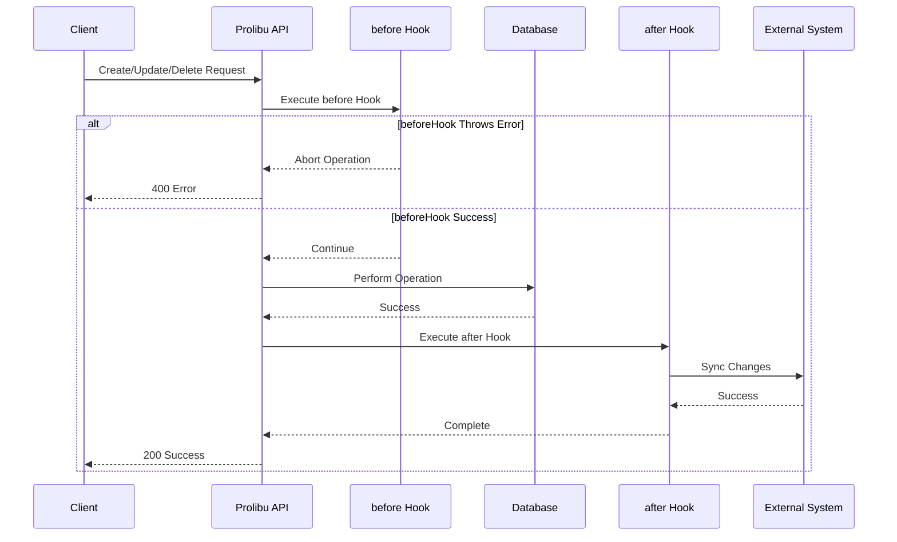

# Lifecycle Hook Events

**Event Type:** `lifecycleHooks`  
**Trigger:** Entity CRUD operations (Create, Update, Delete)  
**Authentication:** System (No API key required)  
**Use Case:** Real-time data synchronization, validation, side effects

## Overview

Lifecycle Hook events are triggered automatically when entities are created, updated, or deleted in Prolibu. This is the most powerful event type for real-time integrations.

Perfect for:
- **Bidirectional synchronization** with external CRMs (Salesforce, HubSpot)
- **Data validation** before operations
- **Audit logging** and history tracking
- **Side effects** like notifications or cascade operations
- **Data enrichment** from external sources

## The 6 Lifecycle Hooks

| Hook | Trigger | Can Abort? | eventData Fields | Use Case |
|------|---------|------------|------------------|----------|
| **beforeCreate** | Before entity creation | ✅ Yes | `doc` | Validation, enrichment, abort creation |
| **afterCreate** | After entity creation | ❌ No | `doc` | Sync to external systems, notifications |
| **beforeUpdate** | Before entity update | ✅ Yes | `doc`, `beforeUpdateDoc`, `payload` | Validation, conditional updates |
| **afterUpdate** | After entity update | ❌ No | `doc`, `beforeUpdateDoc`, `payload` | Sync changes to external systems |
| **beforeDelete** | Before entity deletion | ✅ Yes | `doc` | Validation, prevent deletion |
| **afterDelete** | After entity deletion | ❌ No | `doc` | Cascade deletes, sync deletion |

## How It Works



## Configuration

### Script Structure

Lifecycle hooks are defined in a script with handlers object:

```javascript
module.exports = {
  // Hook handlers
  Handlers: {
    beforeCreate: async (doc, { API, requestUser, logger }) => {
      // Logic before creation
    },
    
    afterCreate: async (doc, { API, requestUser, logger }) => {
      // Logic after creation
    },
    
    beforeUpdate: async (doc, beforeUpdateDoc, payload, { API, requestUser, logger }) => {
      // Logic before update
    },
    
    afterUpdate: async (doc, beforeUpdateDoc, payload, { API, requestUser, logger }) => {
      // Logic after update
    },
    
    beforeDelete: async (doc, { API, requestUser, logger }) => {
      // Logic before deletion
    },
    
    afterDelete: async (doc, { API, requestUser, logger }) => {
      // Logic after deletion
    },
  },
  
  // Entity configuration
  EntityConfig: [
    {
      objectName: 'Contact',           // Prolibu entity name
      externalObjectName: 'Contact',   // External system object name
      defaultEvents: ['afterCreate', 'afterUpdate', 'afterDelete'],
      globalTransforms: {
        // Field-level transforms
      },
      fieldsMap: {
        // Field mapping configuration
      }
    }
  ]
};
```

### Real Example from Codebase

See [`/accounts/dev10.prolibu.com/hook-integrations/outbound-salesforce.js`](../../../accounts/dev10.prolibu.com/hook-integrations/outbound-salesforce.js) for a complete production example.

## Event Data Structure

### beforeCreate / afterCreate / beforeDelete / afterDelete

```javascript
{
  // Base fields
  apiKey: null,
  requestUser: Object,           // User who triggered the operation
  eventName: "lifecycleHooks",
  scriptId: String,
  
  // Lifecycle-specific fields
  eventData: {
    doc: Object,                 // The entity document
    hookType: String,            // beforeCreate, afterCreate, etc.
    objectName: String,          // Entity name (e.g., 'Contact')
  }
}
```

### beforeUpdate / afterUpdate

```javascript
{
  // Base fields (same as above)
  
  // Update-specific fields
  eventData: {
    doc: Object,                 // Current state (after update)
    beforeUpdateDoc: Object,     // Previous state (before update)
    payload: Object,             // Only the fields that changed
    hookType: String,            // beforeUpdate or afterUpdate
    objectName: String,
  }
}
```

### Example Event Data

```javascript
// afterUpdate event
{
  requestUser: {
    _id: "507f1f77bcf86cd799439011",
    email: "user@example.com",
    name: "John Admin"
  },
  eventName: "lifecycleHooks",
  scriptId: "507f191e810c19729de860ea",
  eventData: {
    hookType: "afterUpdate",
    objectName: "Contact",
    
    // Previous state
    beforeUpdateDoc: {
      _id: "60c72b2f9b1d4c3a1c8b4567",
      name: "Jane Doe",
      email: "jane.old@example.com",
      mobile: "+1234567890",
      status: "active"
    },
    
    // Current state
    doc: {
      _id: "60c72b2f9b1d4c3a1c8b4567",
      name: "Jane Smith",              // Changed
      email: "jane.new@example.com",   // Changed
      mobile: "+1234567890",
      status: "active"
    },
    
    // Only changed fields
    payload: {
      name: "Jane Smith",
      email: "jane.new@example.com"
    }
  }
}
```

## Hook Implementations

### beforeCreate Hook

**Purpose**: Validate, enrich, or abort entity creation

```javascript
Handlers: {
  beforeCreate: async (doc, { API, requestUser, logger }) => {
    logger.info('Before creating', { doc });
    
    // 1. Validation
    if (!doc.email) {
      throw new Error('Email is required');  // Aborts creation
    }
    
    // 2. Enrichment
    if (!doc.status) {
      doc.status = 'active';  // Set default value
    }
    
    // 3. External validation
    const exists = await API.salesforce.findOne('Contact', {
      Email: doc.email
    });
    
    if (exists) {
      throw new Error('Contact already exists in Salesforce');
    }
    
    // 4. Modify doc before creation
    doc.source = 'prolibu';
    doc.createdBy = requestUser._id;
    
    return doc;  // Optional: return modified doc
  }
}
```

### afterCreate Hook

**Purpose**: Sync to external systems, send notifications

```javascript
Handlers: {
  afterCreate: async (doc, { API, requestUser, logger }) => {
    logger.info('After creating', { docId: doc._id });
    
    try {
      // 1. Map Prolibu data to Salesforce format
      const mapped = DataMapper.mapWithConfig(doc, entityConfig, logger);
      
      // 2. Create in Salesforce
      const sfResult = await API.salesforce.create('Contact', {
        FirstName: mapped.firstName,
        LastName: mapped.lastName,
        Email: mapped.email,
        MobilePhone: mapped.mobile
      });
      
      logger.info('Synced to Salesforce', {
        prolibuId: doc._id,
        salesforceId: sfResult.id
      });
      
      // 3. Store external ID in Prolibu
      await API.prolibu.update('Contact', doc._id, {
        externalId: sfResult.id
      });
      
      // 4. Send notification (optional)
      // await sendNotification('Contact created', doc);
      
    } catch (error) {
      logger.error('Failed to sync to Salesforce', error);
      // Don't throw - entity is already created
    }
  }
}
```

### beforeUpdate Hook

**Purpose**: Validate changes, conditional updates

```javascript
Handlers: {
  beforeUpdate: async (doc, beforeUpdateDoc, payload, { API, requestUser, logger }) => {
    logger.info('Before updating', {
      docId: doc._id,
      changes: Object.keys(payload)
    });
    
    // 1. Validate specific field changes
    if (payload.email) {
      // Check if new email is valid
      if (!isValidEmail(payload.email)) {
        throw new Error('Invalid email format');
      }
      
      // Check if email already exists
      const existing = await API.prolibu.findOne('Contact', {
        email: payload.email,
        _id: { $ne: doc._id }
      });
      
      if (existing) {
        throw new Error('Email already in use');
      }
    }
    
    // 2. Prevent certain changes
    if (payload.status === 'deleted' && beforeUpdateDoc.hasActiveOrders) {
      throw new Error('Cannot delete contact with active orders');
    }
    
    // 3. Conditional modifications
    if (payload.status && payload.status !== beforeUpdateDoc.status) {
      doc.statusChangedAt = new Date();
      doc.statusChangedBy = requestUser._id;
    }
    
    return doc;
  }
}
```

### afterUpdate Hook

**Purpose**: Sync changes to external systems

```javascript
Handlers: {
  afterUpdate: async (doc, beforeUpdateDoc, payload, { API, requestUser, logger }) => {
    logger.info('After updating', {
      docId: doc._id,
      changes: Object.keys(payload)
    });
    
    try {
      // 1. Only sync if specific fields changed
      const syncFields = ['name', 'email', 'mobile', 'company'];
      const shouldSync = Object.keys(payload).some(key => 
        syncFields.includes(key)
      );
      
      if (!shouldSync) {
        logger.debug('No syncable fields changed, skipping');
        return;
      }
      
      // 2. Get external ID
      const externalId = doc.externalId;
      if (!externalId) {
        logger.warn('No external ID found, creating in Salesforce');
        // Create instead of update
        await createInSalesforce(doc, API, logger);
        return;
      }
      
      // 3. Map only changed fields
      const mapped = DataMapper.mapWithConfig(payload, entityConfig, logger);
      
      // 4. Update in Salesforce
      await API.salesforce.update('Contact', externalId, {
        FirstName: mapped.firstName,
        LastName: mapped.lastName,
        Email: mapped.email,
        MobilePhone: mapped.mobile
      });
      
      logger.info('Updated in Salesforce', {
        prolibuId: doc._id,
        salesforceId: externalId,
        fields: Object.keys(mapped)
      });
      
    } catch (error) {
      logger.error('Failed to sync update to Salesforce', error);
      // Don't throw - entity is already updated
    }
  }
}
```

### beforeDelete Hook

**Purpose**: Prevent deletion, validation

```javascript
Handlers: {
  beforeDelete: async (doc, { API, requestUser, logger }) => {
    logger.info('Before deleting', { docId: doc._id });
    
    // 1. Check for dependencies
    const hasOrders = await API.prolibu.count('Order', {
      contactId: doc._id,
      status: 'active'
    });
    
    if (hasOrders > 0) {
      throw new Error('Cannot delete contact with active orders');
    }
    
    // 2. Require specific permissions
    if (!requestUser.isAdmin) {
      throw new Error('Only admins can delete contacts');
    }
    
    // 3. Soft delete instead
    if (doc.hasHistory) {
      // Convert to soft delete
      await API.prolibu.update('Contact', doc._id, {
        status: 'deleted',
        deletedAt: new Date(),
        deletedBy: requestUser._id
      });
      
      throw new Error('Contact archived instead of deleted');
    }
    
    logger.info('Deletion allowed', { docId: doc._id });
  }
}
```

### afterDelete Hook

**Purpose**: Cascade deletes, sync deletion

```javascript
Handlers: {
  afterDelete: async (doc, { API, requestUser, logger }) => {
    logger.info('After deleting', { docId: doc._id });
    
    try {
      // 1. Delete from external system
      if (doc.externalId) {
        const deleted = await API.salesforce.delete('Contact', doc.externalId);
        
        if (deleted) {
          logger.info('Deleted from Salesforce', {
            prolibuId: doc._id,
            salesforceId: doc.externalId
          });
        } else {
          logger.warn('Contact not found in Salesforce', {
            salesforceId: doc.externalId
          });
        }
      }
      
      // 2. Cascade delete related records
      const relatedAddresses = await API.prolibu.find('Address', {
        contactId: doc._id
      });
      
      for (const address of relatedAddresses) {
        await API.prolibu.delete('Address', address._id);
      }
      
      logger.info('Cascade deleted addresses', {
        count: relatedAddresses.length
      });
      
      // 3. Log for audit
      await API.prolibu.create('AuditLog', {
        action: 'delete',
        objectName: 'Contact',
        objectId: doc._id,
        userId: requestUser._id,
        timestamp: new Date(),
        data: doc
      });
      
    } catch (error) {
      logger.error('Failed to complete after-delete actions', error);
      // Don't throw - entity is already deleted
    }
  }
}
```

## Real-World Example: Bidirectional Sync

Complete example from the codebase:

```javascript
/**
 * Outbound Salesforce Integration
 * Syncs Contact changes from Prolibu to Salesforce
 */

const DataMapper = require('../../../lib/vendors/prolibu/DataMapper');
const ContactMap = require('../../../lib/vendors/salesforce/maps/ContactMap');

module.exports = {
  Handlers: {
    // After a contact is created in Prolibu
    afterCreate: async (doc, { API, requestUser, logger }) => {
      const mapped = DataMapper.mapWithConfig(doc, entityConfig, logger);
      
      const sfContact = await API.salesforce.create('Contact', {
        FirstName: mapped.firstName,
        LastName: mapped.lastName,
        Email: mapped.email,
        MobilePhone: mapped.mobile
      });
      
      // Store Salesforce ID in Prolibu
      await API.prolibu.update('Contact', doc._id, {
        externalId: sfContact.id
      });
      
      logger.info('Contact synced to Salesforce', {
        prolibuId: doc._id,
        salesforceId: sfContact.id
      });
    },
    
    // After a contact is updated in Prolibu
    afterUpdate: async (doc, beforeUpdateDoc, payload, { API, requestUser, logger }) => {
      if (!doc.externalId) {
        logger.warn('No Salesforce ID, skipping sync');
        return;
      }
      
      // Only sync if specific fields changed
      const syncFields = ['name', 'email', 'mobile'];
      const hasChanges = Object.keys(payload).some(key => 
        syncFields.includes(key)
      );
      
      if (!hasChanges) {
        logger.debug('No syncable fields changed');
        return;
      }
      
      const mapped = DataMapper.mapWithConfig(payload, entityConfig, logger);
      
      await API.salesforce.update('Contact', doc.externalId, {
        FirstName: mapped.firstName,
        LastName: mapped.lastName,
        Email: mapped.email,
        MobilePhone: mapped.mobile
      });
      
      logger.info('Contact updated in Salesforce', {
        prolibuId: doc._id,
        salesforceId: doc.externalId
      });
    },
    
    // After a contact is deleted in Prolibu
    afterDelete: async (doc, { API, requestUser, logger }) => {
      if (!doc.externalId) {
        logger.warn('No Salesforce ID, skipping delete');
        return;
      }
      
      const deleted = await API.salesforce.delete('Contact', doc.externalId);
      
      if (deleted) {
        logger.info('Contact deleted from Salesforce', {
          prolibuId: doc._id,
          salesforceId: doc.externalId
        });
      } else {
        logger.warn('Contact not found in Salesforce');
      }
    },
  },
  
  EntityConfig: [
    {
      objectName: 'Contact',
      externalObjectName: 'Contact',
      defaultEvents: ['afterCreate', 'afterUpdate', 'afterDelete'],
      globalTransforms: {
        OwnerId: '005xx000001X8UzAAK'  // Default Salesforce owner
      },
      fieldsMap: ContactMap
    }
  ]
};

// Contact configuration
const entityConfig = {
  objectName: 'Contact',
  externalObjectName: 'Contact',
  fieldsMap: ContactMap,
  globalTransforms: {
    OwnerId: '005xx000001X8UzAAK'
  }
};
```

## Entity Configuration

### EntityConfig Structure

```javascript
EntityConfig: [
  {
    // Required fields
    objectName: String,                // Prolibu entity name
    externalObjectName: String,        // External system object name
    defaultEvents: Array<String>,      // Which hooks to enable
    
    // Optional fields
    globalTransforms: Object,          // Applied to all records
    fieldsMap: Object,                 // Field mapping configuration
    filter: Object,                    // Only sync matching records
    
    // Advanced options
    batchSize: Number,                 // For bulk operations
    retryOnFailure: Boolean,           // Retry failed syncs
    cascadeDelete: Boolean,            // Delete related records
  }
]
```

### Field Mapping

```javascript
fieldsMap: {
  // Simple mapping
  email: 'Email',
  mobile: 'MobilePhone',
  
  // Nested mapping
  'name': 'FirstName LastName',  // Split name into first/last
  
  // Transform function
  status: {
    externalField: 'Status__c',
    transform: (value) => value.toUpperCase()
  },
  
  // Conditional mapping
  owner: {
    externalField: 'OwnerId',
    transform: (value, doc) => {
      return doc.assignedTo || '005xx000001X8UzAAK';
    }
  }
}
```

### Global Transforms

Applied to all records:

```javascript
globalTransforms: {
  OwnerId: '005xx000001X8UzAAK',      // Default owner
  RecordTypeId: '012xx000000abcdAAA',  // Default record type
  Source__c: 'Prolibu',                // Track source
  SyncedAt__c: () => new Date()        // Dynamic value
}
```

### Default Events

Specify which hooks to enable:

```javascript
defaultEvents: ['afterCreate', 'afterUpdate', 'afterDelete']

// Or be selective:
defaultEvents: ['afterCreate']  // Only sync new records

// All possible events:
defaultEvents: [
  'beforeCreate',
  'afterCreate',
  'beforeUpdate',
  'afterUpdate',
  'beforeDelete',
  'afterDelete'
]
```

## Use Cases

### 1. Bidirectional CRM Sync

Sync contacts between Prolibu and Salesforce/HubSpot:

```javascript
// afterUpdate: Sync changes FROM Prolibu TO Salesforce
afterUpdate: async (doc, beforeUpdateDoc, payload, { API, logger }) => {
  await API.salesforce.update('Contact', doc.externalId, mappedData);
}

// Webhook endpoint: Sync changes FROM Salesforce TO Prolibu
// (See EndpointRequest documentation)
```

### 2. Data Validation

Validate data before creation:

```javascript
beforeCreate: async (doc, { API, logger }) => {
  // Validate email format
  if (!isValidEmail(doc.email)) {
    throw new Error('Invalid email format');
  }
  
  // Check for duplicates
  const exists = await API.prolibu.findOne('Contact', {
    email: doc.email
  });
  
  if (exists) {
    throw new Error('Contact with this email already exists');
  }
}
```

### 3. Audit Logging

Track all changes:

```javascript
afterUpdate: async (doc, beforeUpdateDoc, payload, { API, requestUser, logger }) => {
  await API.prolibu.create('AuditLog', {
    action: 'update',
    objectName: 'Contact',
    objectId: doc._id,
    userId: requestUser._id,
    changes: payload,
    before: beforeUpdateDoc,
    after: doc,
    timestamp: new Date()
  });
}
```

### 4. Cascade Operations

Delete related records:

```javascript
afterDelete: async (doc, { API, logger }) => {
  // Delete all addresses for this contact
  const addresses = await API.prolibu.find('Address', {
    contactId: doc._id
  });
  
  for (const address of addresses) {
    await API.prolibu.delete('Address', address._id);
  }
  
  logger.info(`Cascade deleted ${addresses.length} addresses`);
}
```

### 5. Data Enrichment

Enrich data from external sources:

```javascript
beforeCreate: async (doc, { API, logger }) => {
  // Lookup company data from external service
  if (doc.company) {
    const companyData = await fetchCompanyData(doc.company);
    doc.industry = companyData.industry;
    doc.companySize = companyData.employeeCount;
  }
  
  return doc;
}
```

## Best Practices

### ✅ DO

- **Use afterHooks for Syncing**: Sync after the operation completes
- **Validate in beforeHooks**: Prevent bad data with validation
- **Log Everything**: Use structured logging for debugging
- **Handle Errors Gracefully**: Don't throw in afterHooks
- **Use Payload in Updates**: Only sync fields that changed
- **Implement Idempotency**: Handle duplicate executions
- **Check External IDs**: Verify records exist before updating
- **Use Boolean Returns**: Return true/false from delete operations
- **Batch Operations**: Process multiple records efficiently
- **Track Sync State**: Store sync timestamps and status

### ❌ DON'T

- **Throw in afterHooks**: Operation is already complete, log errors instead
- **Sync Everything in Updates**: Only sync changed fields (use payload)
- **Create Infinite Loops**: Prevent hook → update → hook cycles
- **Skip Error Handling**: Always wrap external API calls in try/catch
- **Block Too Long**: Keep hooks fast, queue heavy operations
- **Ignore Context**: Use requestUser for permissions/audit
- **Hard-code Values**: Use environment variables for external IDs
- **Sync Unchanged Data**: Check payload before syncing

## Error Handling

### In beforeHooks (Can Abort)

```javascript
beforeCreate: async (doc, { API, logger }) => {
  try {
    // Validation
    await validateContact(doc);
    return doc;
    
  } catch (error) {
    logger.error('Validation failed', error);
    throw error;  // ✅ Throws abort the operation
  }
}
```

### In afterHooks (Cannot Abort)

```javascript
afterCreate: async (doc, { API, logger }) => {
  try {
    // Sync to Salesforce
    await API.salesforce.create('Contact', mappedData);
    logger.info('Synced successfully');
    
  } catch (error) {
    logger.error('Sync failed', error);
    // ❌ DON'T throw - entity is already created
    // ✅ DO log the error for retry later
    
    // Optional: Queue for retry
    await API.prolibu.create('SyncQueue', {
      type: 'contact-create',
      contactId: doc._id,
      error: error.message,
      retryCount: 0
    });
  }
}
```

## Preventing Infinite Loops

### Problem

```javascript
// ❌ BAD: Creates infinite loop
afterUpdate: async (doc, beforeUpdateDoc, payload, { API, logger }) => {
  // This triggers another afterUpdate → infinite loop
  await API.prolibu.update('Contact', doc._id, {
    lastSyncedAt: new Date()
  });
}
```

### Solutions

#### 1. Check Payload

```javascript
// ✅ GOOD: Only sync specific fields
afterUpdate: async (doc, beforeUpdateDoc, payload, { API, logger }) => {
  const syncFields = ['name', 'email', 'mobile'];
  const shouldSync = Object.keys(payload).some(key => 
    syncFields.includes(key)
  );
  
  if (!shouldSync) {
    logger.debug('No syncable fields changed, skipping');
    return;
  }
  
  // Sync to external system...
}
```

#### 2. Use Sync Flags

```javascript
// ✅ GOOD: Use flag to prevent loops
afterUpdate: async (doc, beforeUpdateDoc, payload, { API, logger }) => {
  // Skip if this update came from sync
  if (payload._skipHooks || payload._syncUpdate) {
    return;
  }
  
  // Sync to Salesforce
  await API.salesforce.update('Contact', doc.externalId, mappedData);
  
  // Update with sync flag (won't trigger hook)
  await API.prolibu.update('Contact', doc._id, {
    lastSyncedAt: new Date(),
    _skipHooks: true
  });
}
```

#### 3. Compare Values

```javascript
// ✅ GOOD: Only sync if value actually changed
afterUpdate: async (doc, beforeUpdateDoc, payload, { API, logger }) => {
  if (doc.email === beforeUpdateDoc.email) {
    return;  // Email didn't change
  }
  
  // Sync email change to Salesforce...
}
```

## Testing

### Unit Testing Hooks

```javascript
// test/outbound-salesforce.test.js
describe('Contact Lifecycle Hooks', () => {
  it('syncs contact creation to Salesforce', async () => {
    // Create contact in Prolibu
    const contact = await API.prolibu.create('Contact', {
      name: 'John Doe',
      email: 'john@example.com',
      mobile: '+1234567890'
    });
    
    // Wait for afterCreate hook
    await sleep(1000);
    
    // Verify sync to Salesforce
    const sfContact = await API.salesforce.findOne('Contact', {
      Email: 'john@example.com'
    });
    
    expect(sfContact).toBeDefined();
    expect(sfContact.FirstName).toBe('John');
    expect(sfContact.LastName).toBe('Doe');
  });
  
  it('syncs contact updates to Salesforce', async () => {
    // Update contact
    await API.prolibu.update('Contact', contactId, {
      mobile: '+9876543210'
    });
    
    // Wait for afterUpdate hook
    await sleep(1000);
    
    // Verify update in Salesforce
    const sfContact = await API.salesforce.findOne('Contact', {
      Id: externalId
    });
    
    expect(sfContact.MobilePhone).toBe('+9876543210');
  });
});
```

### Integration Testing

```bash
# Run integration tests
npm test -- accounts/dev10.prolibu.com/hook-integrations/test/outbound-salesforce.test.js
```

## Performance Optimization

### Batch Processing

```javascript
afterUpdate: async (doc, beforeUpdateDoc, payload, { API, logger }) => {
  // Add to batch queue instead of immediate sync
  await API.prolibu.create('SyncQueue', {
    type: 'contact-update',
    contactId: doc._id,
    payload: payload,
    status: 'pending'
  });
  
  // Separate scheduled task processes queue in batches
}
```

### Conditional Execution

```javascript
afterUpdate: async (doc, beforeUpdateDoc, payload, { API, logger }) => {
  // Only sync during business hours
  const hour = new Date().getHours();
  if (hour < 8 || hour > 18) {
    logger.debug('Outside business hours, queueing for later');
    await queueForLater(doc, payload);
    return;
  }
  
  // Immediate sync
  await syncToSalesforce(doc, payload);
}
```

### Async Non-Blocking

```javascript
afterCreate: async (doc, { API, logger }) => {
  // Don't wait for external API
  syncToSalesforce(doc, API, logger).catch(error => {
    logger.error('Async sync failed', error);
  });
  
  // Return immediately
  return;
}
```

## Related Documentation

- **[Event System Overview](./README.md)** - Understanding the event system
- **[ApiRun Events](./01-api-run.md)** - Manual script execution
- **[ScheduledTask Events](./02-scheduled-task.md)** - Automated periodic tasks
- **[Example: Salesforce Integration](../../../accounts/dev10.prolibu.com/hook-integrations/outbound-salesforce.js)** - Real implementation
- **[Example: HubSpot Integration](../../../accounts/dev10.prolibu.com/hook-integrations/outbound-hubspot.js)** - Real implementation

---

**Back to:** [Events Overview](./README.md) | [Main Documentation](../README.md)
