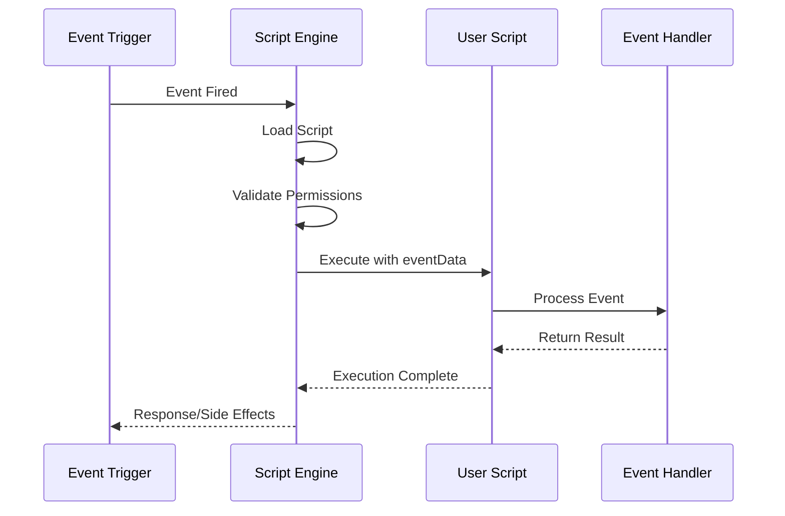
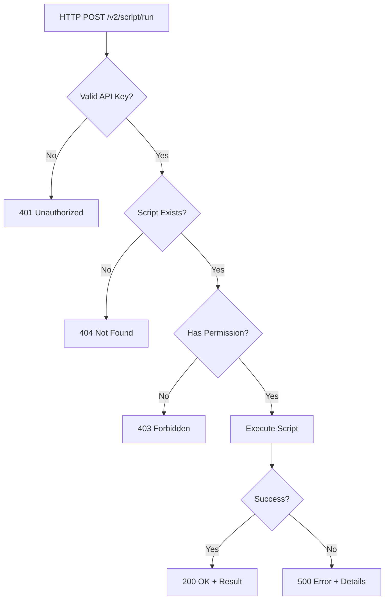
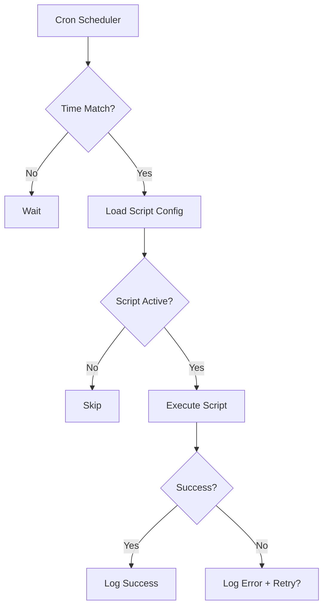
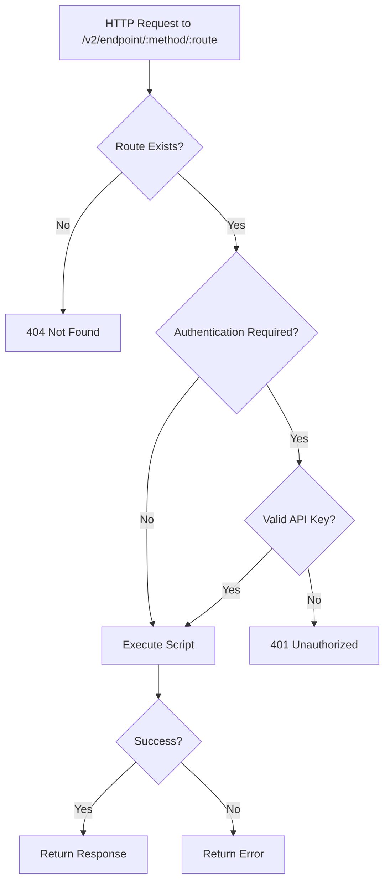
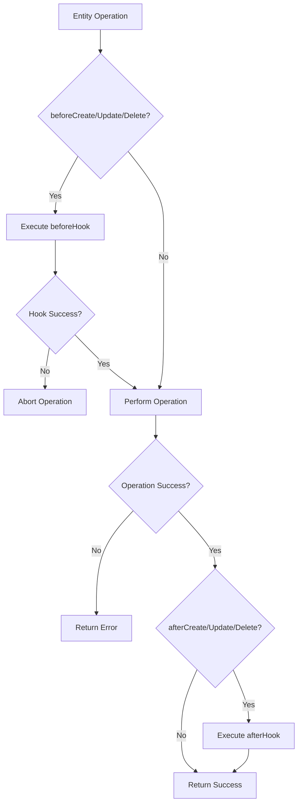

# Event System Overview

The Prolibu Script Builder is powered by a flexible event-driven architecture that allows scripts to respond to various types of triggers throughout the platform.

## 📋 Table of Contents

- [Architecture Overview](#architecture-overview)
- [Event Types Comparison](#event-types-comparison)
- [Event Execution Flow](#event-execution-flow)
- [Event Data Structure](#event-data-structure)
- [Security & Permissions](#security--permissions)
- [Error Handling](#error-handling)

## Architecture Overview

### Core Concepts

The event system is built on three main components:

1. **Event Triggers** - Events that initiate script execution
2. **Script Engine** - Processes and executes scripts
3. **Event Handlers** - Custom code that responds to events



## Event Types Comparison

| Feature | ApiRun | ScheduledTask | EndpointRequest | Lifecycle Hooks |
|---------|--------|---------------|-----------------|-----------------|
| **Trigger** | Manual API call | Cron schedule | HTTP request to custom route | Entity CRUD operation |
| **Frequency** | On-demand | Periodic | On-demand | Real-time |
| **Input Source** | API request | Scheduler | HTTP request | Entity changes |
| **Authentication** | API Key | System | API Key (optional) | System |
| **Use Case** | Ad-hoc operations | Batch processing | Custom APIs | Data synchronization |
| **Async** | Yes | Yes | Yes | Yes |
| **Retry Logic** | Manual | Automatic | Manual | Event-based |

## Event Execution Flow

### 1. ApiRun Events



### 2. ScheduledTask Events



### 3. EndpointRequest Events



### 4. Lifecycle Hook Events



## Event Data Structure

All events receive a standardized `eventData` object, but the contents vary by event type:

### Common Fields

Every event includes these base parameters:

```javascript
{
  apiKey: String,           // API key used for authentication
  requestUser: Object,      // User object if authenticated
  eventName: String,        // Type of event (ApiRun, ScheduledTask, etc.)
  eventData: Object,        // Event-specific data (varies by type)
  scriptId: String,         // ID of the script being executed
}
```

### Event-Specific Data

#### ApiRun
```javascript
eventData: {
  query: Object,    // URL query parameters
  body: Object,     // Request body
}
```

#### ScheduledTask
```javascript
eventData: {
  scheduledAt: Date,        // When the task was scheduled
  periodicity: String,      // Cron expression
}
```

#### EndpointRequest
```javascript
eventData: {
  endpoint: {
    _id: String,
    endpointCode: String,
    endpointName: String,
    routeName: String,
    url: String,
    method: String,         // GET, POST, PUT, DELETE
  },
  authenticated: Boolean,
  headers: Object,
  query: Object,
  body: Object,
}
```

#### Lifecycle Hooks
```javascript
eventData: {
  doc: Object,              // Current/new entity state
  beforeUpdateDoc: Object,  // Previous state (update only)
  payload: Object,          // Changed fields (update only)
}
```

## Security & Permissions

### Authentication Methods

1. **API Key Authentication** (ApiRun, EndpointRequest)
   - Required in request headers or query params
   - Validated against user API keys

2. **System Authentication** (ScheduledTask, Lifecycle Hooks)
   - Internal system triggers
   - No external authentication needed

### Permission Checks

Scripts include permission validation:

```javascript
scriptPermissionsQuery: await getPermissionsQuery(Script, req)
```

This ensures users can only execute scripts they have access to.

### Security Best Practices

✅ **DO:**
- Always validate input data
- Use API keys for external triggers
- Implement rate limiting for ApiRun and EndpointRequest
- Log security events

❌ **DON'T:**
- Expose sensitive data in logs
- Skip permission checks
- Hard-code credentials in scripts
- Trust user input without validation

## Error Handling

### Error Response Format

All events return standardized error responses:

```javascript
{
  success: false,
  error: {
    message: String,      // Human-readable error message
    code: String,         // Error code (e.g., 'VALIDATION_ERROR')
    statusCode: Number,   // HTTP status code
    details: Object,      // Additional error context
  }
}
```

### Common Error Codes

| Code | Status | Description |
|------|--------|-------------|
| `UNAUTHORIZED` | 401 | Invalid or missing API key |
| `FORBIDDEN` | 403 | Insufficient permissions |
| `NOT_FOUND` | 404 | Script or endpoint not found |
| `VALIDATION_ERROR` | 400 | Invalid input data |
| `RATE_LIMIT_EXCEEDED` | 429 | Too many requests |
| `INTERNAL_ERROR` | 500 | Script execution error |

### Retry Logic

- **ApiRun**: No automatic retry (client-controlled)
- **ScheduledTask**: Automatic retry with exponential backoff
- **EndpointRequest**: No automatic retry (client-controlled)
- **Lifecycle Hooks**: Event-driven retry on failure

## Next Steps

Choose an event type to learn more:

1. **[ApiRun Events](./01-api-run.md)** - Manual script execution via API
2. **[ScheduledTask Events](./02-scheduled-task.md)** - Automated periodic tasks
3. **[EndpointRequest Events](./03-endpoint-request.md)** - Custom API endpoints
4. **[Lifecycle Hook Events](./04-lifecycle-hooks.md)** - Real-time entity synchronization

---

**Back to:** [Main Documentation](../README.md)
